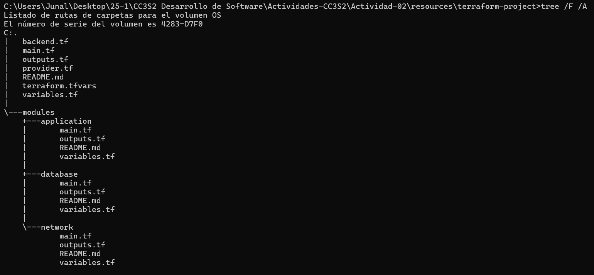
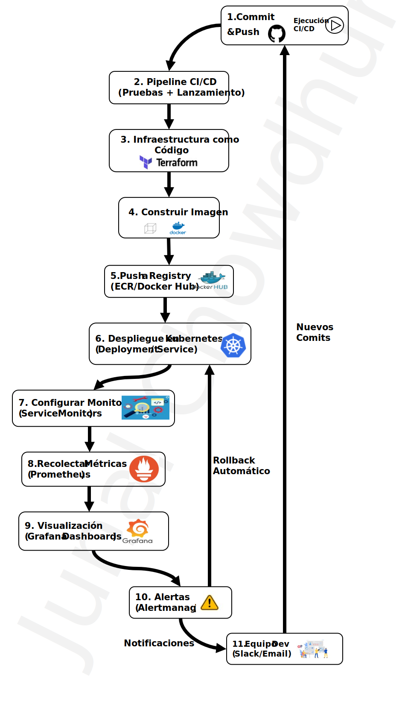

# **Actividad 2:  Del codigo a la produccion: Infraestructura, contenedores, despliegue y observabilidad**

`Junal Chowdhury Gomez`
## **Presentacion de la Actividad 2**
[Presentacion Actividad 2](Actividad%202%20Presentacion.pdf)

## **Descripcion de la actividad**

### **A. Infraestructura como Codigo**

> **Tarea teorica:**  
> - Investigar una herramienta de IaC (p. ej. Terraform) y describir como organiza sus modulos.  
> - Proponer la estructura de archivos y directorios para un proyecto hipotetico que incluya tres modulos: `network`, `database` y `application`. Justificar la jerarquia elegida.


#### **1. Fuentes:**

* [Amazon: Descripcion de los modulos de Terraform](https://docs.aws.amazon.com/es_es/prescriptive-guidance/latest/getting-started-terraform/modules.html)

* [Terraform: Modules overview](https://developer.hashicorp.com/terraform/tutorials/modules/module)

* [Proyecto Terraform: Despliegue de infraestructura cloud con Terraform](https://ualmtorres.github.io/SeminarioTerraform/)


#### **2. Organizacion de sus modulos**

* Terraform organiza su IaC mediante modulos , que son unidades reutilizables de configuracion

    * un ejemplo de modulos es:  
        - **modulo raiz:** el punto de entrada principal de Terraform
        - **modulos locales:** Se encuentran dentro del mismo repositorio del proyecto
        - **modulos remotos:** guardados en repositorios como Github, Terraform Registry o sistemas de almacenamiento remoto

#### **3. Estrictura de archivos y directorios para un proyecto**

* un proyecto hipotetico que se asemeja al proyecto de la [Fuente](https://ualmtorres.github.io/SeminarioTerraform/):
* Una **red** (network)) con una VPC y subredes
* una **base de datos** (database) en PostgreSQL en la nube por ejemplo
* una **aplicacion** (application) que se ejecuta en instancias de computacion
    
    

#### **Explicacion de la estructura y jerarquia**
* los **\modules** contiene modulos (network, database, application)
    los modulos contiene:
    - **main.tf**: configuracion principal
    - **variables.tf**: parametros configurables
    - **outputs.tf**: valores exportables para otros modulos
    - **README.md**: documnetacio del modulo

* el archivo ``main.tf`` en la raiz es el que define el uso de los modulos
    ```h
        module "network" {
            source = "./modules/network"
            vpc_name = "mi-vpc"
        }

        module "database" {
            source = "./modules/database"
            db_name = "mi-database"
        }

        module "application" {
            source = "./modules/application"
            app_name = "mi-app"
        }
    ```
    * el archivo ``provider.tf`` define el provedor de nube, puede ser AWS, GCP, Azure 
    * `terraform.tfvars` contiene variables pesrsonalizadas
    * `backend.tf` es opcional en el caso de que se utilice almacenamiento remoto para el estado

* los principales beneficios la estructura:
    * **Modularidad**:  ya que permite reutilizar componentes y separarlos de la configuracion principal
    * **Escalabilidad**: Es facil agregar mas modulos si el proyecto crece
    * **Mantenibilidad**: Separar logica facilita la depuracion y colaboracion


### **B. Contenerizacion y despliegue de aplicaciones modernas**
> **Tarea teorica:**  
> - Describir un flujo simple de despliegue donde un desarrollador hace un cambio en el codigo, se construye una nueva imagen Docker y se actualiza un Deployment de Kubernetes.  
> - Explicar las ventajas de usar Kubernetes para escalar una aplicacion en un evento de alto trafico.

#### **1. Fuentes**

- [Kubernetes: Deployment](https://kubernetes.io/es/docs/concepts/workloads/controllers/deployment/)
- [IBM: Casos de Usos de Kubernetes](https://www.ibm.com/es-es/think/topics/kubernetes-use-cases)
- [IBM: Beneficios de Kubernetes](https://www.ibm.com/think/insights/kubernetes-benefits)


#### **2. Flujo despliegue con Docker y Kubernetes**

1. Un dessarrollador hace un cambio en el codigo del proyecto
    - agrega cambios al stage
        ```sh
        git add .
        ```
    - confirma cambios
        ```sh
        git commit -m "actualizacion del codigo"
         ```
    - envia cambios
         ```sh
        git push origin main
        ```
2. Se construye una imagen nueva de docker
    - contruye imagen 
    ```sh
    docker build -t mi-app:v2 .
    ```
    - se verifica la imagen

    ```sh
    docker images
    ```
3. Sube la imagen a dockerhub
        
    ```sh
    docker push mi-repo/mi-aplicacion:v2 
    ```    
4. Acualizacion Deployment de kubernetes
    - se modifca el `deployment.yaml` con la nueva actualizacion de version de la imagen, similar a la [Fuente](https://kubernetes.io/es/docs/concepts/workloads/controllers/deployment/):

    ```yaml
        apiVersion: apps/v1
        kind: Deployment
        metadata:
            name: mi-aplicacion
        spec:
            replicas: 3
            selector:
                matchLabels:
                app: mi-app
        template:
            metadata:
                labels:
                    app: mi-app
            spec:
                containers:
                    - name: mi-contenedor
                        image: mi-repo/mi-aplicacion:v2  # <--aqui se actualiz la version
                        ports:
                        - containerPort: 8080
    ```
    -   Aplicamos el cambio en Kuberentes
    ```sh
    kubectl apply -f deployment.yaml  
    ```
5. Comprobar el despliegue

    ```sh
    kubectl get pods  

    kubectl describe deployment mi-aplicacion  

    kubectl get events --sort-by=.metadata.creationTimestamp  
    ```
#### **3. Ventajas de usar Kubernetes para escalar una aplicacion en un evento de alto trafico**  
* Teniendo en cuenta las [Fuentes](#b-contenerizacion-y-despliegue-de-aplicaciones-modernas)
1. Autoescalado horizontal: Kubernetes puede aumentar o disminuir la cantidad de pods segnn la carga
2. Balanceo de Carga: Kubernetes usa un Service para distribuir el trafico entre los pods disponibles y  evita que un solo servidor colapse

3. Tolerancia a Fallos: Si un pod falla, Kubernetes lo reinicia automaticamente y garantiza alta disponibilidad

4. Eficiencia en Costos: Kubernetes puede reducir la cantidad de pods cuando el trafico baja, optimizando recursos y costos

### **C. Observabilidad y Troubleshooting**
> **Tarea teorica:**  
> - Investigar y describir como Prometheus y Grafana se integran con Kubernetes para monitorear los contenedores y el cluster.  
> - Proponer un set de metricas y alertas minimas para una aplicacion web (por ejemplo, latencia de peticiones, uso de CPU/memoria, tasa de errores).

#### **1. Fuentes:**
- [IBM: Prometheus y Grafana en un cluster de Kubernetes](https://www.ibm.com/docs/en/txseries/11.1?topic=grafana-installing-prometheus-in-kubernetes-cluster)
- [Grafana: Metricas en prometheus y kubernetes](https://grafana.com/es/blog/2022/10/20/como-gestionar-metricas-de-alta-cardinalidad-en-prometheus-y-kubernetes/)
- [Kubeernetes: Metrics For Kubernetes System Components](https://kubernetes.io/docs/concepts/cluster-administration/system-metrics/)
- [Medium: Implemente Prometheus y Grafana en Kubernetes usando](https://medium.com/@gayatripawar401/deploy-prometheus-and-grafana-on-kubernetes-using-helm-5aa9d4fbae66)
- [Heiioncall: Monitoreo y alertas Kubernetes](https://heiioncall.com/guides/minimalistic-monitoring-and-alerting-for-your-kubernetes-cluster-with-prometheus-and-alertmanager)


#### **2. Integracion de Prometheus y grafana con Kubernetes**

Prometheus y grafana se usan para monitorear contenedores y clusters de kubernetes, obteniendo metricas en tiempo real sobre el uso de recursos, disponibilidad y errores

- **instalacion de Prometheus y Grafana en Kubernetes**

    Teniendo en cuenta la [Fuente](https://medium.com/@gayatripawar401/deploy-prometheus-and-grafana-on-kubernetes-using-helm-5aa9d4fbae66)
    , la forma mas comun  es usando Helm el cual es un gestor paquetes para kubernetes.
    ```sh
    helm repo add prometheus-community https://prometheus-community.github.io/helm-charts  

    # actualiza repositorio
    helm repo update  

    # instala Prometheus y Grafana
    helm install monitoring prometheus-community/kube-prometheus-stack --namespace monitoring --create-namespace
    ```
- **Funcionamiento**

    #### **Prometheus** se comunica con Kubernetes a traves de Service Monitors que recolectan metricas desde nodos, pods y aplicaciones
    #### **Grafana** usa Prometheus como fuente de datos para visualizar metricas en paneles personalizados
    #### **Alertmanager (de Prometheus)** envia notificaciones cuando se detectan problemas como por ejemplo un alto uso de CPU
- **Ejemplo**

    Teniendo en cuenta el [Github prometheus-operator](https://github.com/prometheus-operator/prometheus-operator/blob/main/Documentation/user-guides/running-exporters.md)

    ```yaml
    apiVersion: monitoring.coreos.com/v1
    kind: ServiceMonitor
    metadata:
        name: mi-app-monitor
        labels:
            release: prometheus
    spec:
        selector:
            matchLabels:
                app: mi-app
        endpoints:
            - port: http
                path: /metrics
                interval: 10s
    ``` 

    En el codigo el  **ServiceMonitor** ordena a prometheus que recolecte las metricas desde el service **my-appp**, y se consulta la ruta **metrics/** cada 10 seg
#### **3. Set de Metricas y Alertas Minimas para una Aplicacion Web**

En base a  [Heiioncall: Monitoreo y alertas Kubernetes](https://heiioncall.com/guides/minimalistic-monitoring-and-alerting-for-your-kubernetes-cluster-with-prometheus-and-alertmanager) y modificando los codigos.


| Metricas                  | Descricion |
|--------------------------|------------|
| **latencia HTTP**        | Tiempo de respuesta de la API (p99, p95, promedio) |
| **Tasa de errores HTTP** | Porcentaje de respuestas 5xx y 4xx |
| **uso de CPU y memoria** | Consumos por pod y por nodo |
| **Numero de peticiones** | Total de requests por segundo |
| **numero de pods activos** | Cantidad de replicas funcionando |

* Alerta por alta latencia en la API (> 2s en p99)

```yaml
groups:
- name: api-latency
  rules:
  - alert: HighAPILatency
    expr: histogram_quantile(0.99, rate(http_request_duration_seconds_bucket[5m])) > 2
    for: 2m
    labels:
      severity: critical
    annotations:
      summary: "alta latencia en la API (p99 > 2s)"
```

* Alerta por numero de errores HTTP 5xx alto (> 5% de las peticiones)

```yaml
groups:
- name: http-errors
  rules:
  - alert: HighHttp5xxErrors
    expr: (sum(rate(http_requests_total{status=~"5.."}[5m])) / sum(rate(http_requests_total[5m]))) > 0.05
    for: 5m
    labels:
      severity: critical
    annotations:
      summary: "mas del 5% de las solicitudes estan fallando con errores 5xx"
```

### **D. CI/CD (Integracio  n continua / Despliegue continuo)**
> **Tarea teorica:**  
> - Explicar la diferencia entre entrega continua (continuous delivery) y despliegue continuo (continuous deployment).  
> - Describir la relevancia de implementar pruebas automaticas (unitarias, de integracion, de seguridad) dentro del pipeline.


#### **1. Diferencia entre Entrega Continua (Continuous Delivery) y Despliegue Continuo (Continuous Deployment)**

* **Entrega Continua (Continuous Delivery/CD):**

    * El codigo pasa por un pipeline automatizado (build, pruebas, analisis) y queda listo para ser desplegado en produccion en cualquier momento.

    * el despliegue final a produccion requiere una aprobacion manual (por ejemplo, de un equipo de operaciones o negocio).

    * Objetivo: Garantizar que el software siempre este en un estado desplegable, pero con control humano sobre cuando se libera.

* **Despliegue Continuo (Continuous Deployment):**

    * Cada cambio que pasa todas las etapas del pipeline (incluyendo pruebas automatizadas) se despliega automaticamente a produccion sin intervencion humana.

    * Requiere pruebas extremadamente confiables y monitoreo robusto para detectar fallos rapidamente.

    * Objetivo: Acelerar la entrega de valor al usuario final eliminando pasos manuales.

#### **2. Describir la relevancia de implementar pruebas automaticas (unitarias, de integracion, de seguridad) dentro del pipeline.**

* detectar errores temprano;
    - pruebas unitarias: Verifican componentes individuales 
    - pruebas de integracion: Aseguran que los modulos funcionen correctamente juntos
    - pruebas de seguridad (SAST/DAST): Identifican vulnerabilidades antes de llegar a produccion
* Garantizan calidad consistente:
    - automatizar pruebas evita errrores humanos en revisiones manuales
    - Herramientas como SonarQube o Snyk analizan codigo estatico y dependencias
* Habilitan despliegues confiables:
    - Sin pruebas automatizadas, el riesgo de fallos en produccion aumenta.
    - En Continuous Deployment, son criticas para evitar liberar codigo defectuoso.
* Optimizan tiempo y costos:
    - Corregir un bug en etapas tempranas es mas barato que en produccion.

## **3. Ejemplo de pipeline completo**


### **Encabezado del Workflow**
```yaml
name: CI/CD Pipeline
```


### **Eventos que activan el workflow (`on`)**
```yaml
on:
  push:
    branches: [ "main", "feature/*" ]
  pull_request:
    branches: [ "main" ]
```

Se ejecuta cuando se hace un push en la rama `main` o cualquier rama `feature/*` y tambien se ejecutaa  cuando se hace un pull request en larama main

---

### **Variables de entorno (`env`)**
```yaml
env:
  DOCKER_IMAGE: "ghcr.io/usuario/proyecto"
```
define variable de  entorn **DOCKER_IMAGE** con la direccion en donde se subira laimagen docker

---

### **1. JOB: Build**
```yaml
build:
    runs-on: ubuntu-latest
    steps:
    - name: Check out code
        uses: actions/checkout@v3

    - name: Log in to container registry
        run: |
        echo "${{ secrets.DOCKER_PASSWORD }}" | docker login ghcr.io -u ${{ secrets.DOCKER_USER }} --password-stdin

    - name: Build Docker image
        run: |
        docker build -t $DOCKER_IMAGE:${{ github.sha }} .
    
    - name: Push Docker image
        run: |
        docker push $DOCKER_IMAGE:${{ github.sha }}
```
* clona el codigo de el repositorio
* inicia sesion en el GitHub Container Registry 
* construye la imagen Docker con el codigo actual
* sube la imaggen al registry con un tag basado en el commit SHA


### **2. JOB: Test**

```yaml
test:
    runs-on: ubuntu-latest
    needs: [build]
    steps:
      - name: Check out code
        uses: actions/checkout@v3

      - name: Log in to container registry
        run: |
          echo "${{ secrets.DOCKER_PASSWORD }}" | docker login ghcr.io -u ${{ secrets.DOCKER_USER }} --password-stdin

      - name: Pull Docker image
        run: |
          docker pull $DOCKER_IMAGE:${{ github.sha }}

      - name: Run tests
        run: |
          # Ejemplo: correr pruebas dentro del contenedor
          # Se asume que run_unit_tests.sh y run_integration_tests.sh existen en el repo
          docker run --rm $DOCKER_IMAGE:${{ github.sha }} ./run_unit_tests.sh
          docker run --rm $DOCKER_IMAGE:${{ github.sha }} ./run_integration_tests.sh
```

* descarga la imagen Docker creada en el paso anterior
* eejecuta pruebas unitarias y de integracion dentro de contenedores Docker
* este job depende del job `build`

### **3. JOB: Seguridad**

```yaml
security:
    runs-on: ubuntu-latest
    needs: [build]
    steps:
        - name: Log in to container registry
        run: |
            echo "${{ secrets.DOCKER_PASSWORD }}" | docker login ghcr.io -u ${{ secrets.DOCKER_USER }} --password-stdin

        - name: Pull Docker image
        run: |
            docker pull $DOCKER_IMAGE:${{ github.sha }}

        - name: Docker Scan
        run: |
            # Como alternativa, se puede usar Snyk o trivy
            # Ejemplo: Docker scan nativo
            docker scan $DOCKER_IMAGE:${{ github.sha }} --severity high
```
* descarga la imagen Docker creada en build
* escanea la imagen en busca de vulnerabilidades criticas o de alta severidad usando docker scan
* este job depende del job `build`


### **4. JOB: Deploy**
```yaml
deploy:
    runs-on: ubuntu-latest
    needs: [test, security]
    steps:
      - name: Check out code
        uses: actions/checkout@v3

      - name: Set up kubectl
        uses: azure/setup-kubectl@v3
        with:
          version: 'latest'
      
      - name: Configure Kube Credentials
        # Se asume que en el secret KUBE_CONFIG esta guardado el contenido del archivo ~/.kube/config
        run: |
          mkdir -p ~/.kube
          echo "${{ secrets.KUBE_CONFIG }}" > ~/.kube/config

      - name: Update Kubernetes Deployment
        run: |
          kubectl set image deployment/proyecto-deployment \
            proyecto-container=$DOCKER_IMAGE:${{ github.sha }}
          kubectl rollout status deployment/proyecto-deployment
```
* configura kubecctl para conectarse al cluster de Kubernetes
* actualiza el deployment para usar la nueva imagen
* verifica que el despliegue se haya realizado correctamente
* este job depende de los jobs `security` y `test`


## **4. Evaluacion y discusion final**

### **1. Evaluacion de la teoria**
* El informe esta en [Informe](Informe.md)
### **2. Discusion en grupo**
* Fuentes:
    * [Case Study: How Netflix became a master of DevOps?](https://medium.com/%40maeydhaw/case-study-how-netflix-became-a-master-of-devops-7f6f6fa8ad86)
    * [Uber: Observability at Scale: Building Uber’s Alerting Ecosystem](https://www.uber.com/en-PE/blog/observability-at-scale/)
    * [Caso Uber: Retos en la Transición a Microservicios](https://prezi.com/p/sbmlwbuimwzp/caso-uber-retos-en-la-transicion-a-microservicios/)
    * [Medium: Spotify CI migration](https://medium.com/%40dmosyan/spotify-ci-migration-to-achieve-4-x-faster-pipelines-cd8835685982)
    * [How DevOps Reduces Time to Market?](https://cloud.folio3.com/blog/devops-time-to-market/)


#### Debatir cómo la adopción de estas prácticas puede acelerar el “time to market” de un producto
En base a la fuente: [Cloud Folio3: How DevOps Reduces Time to Market?](https://cloud.folio3.com/blog/devops-time-to-market/)


##### **1. Automatización y Eliminación de Tareas Manuales**  
- **antes** La infraestructura se configuraba manualmente lo que podía tomar semanas o meses
- **ahora** Con **IaC en el curso utilizaremos Terraform** , la infraestructura se provisiona automáticamente en minutos  
- **Impacto** menos errores humanos y tiempos de despliegue más cortos 

##### **2. Desarrollo y Pruebas Continuas**  
- **antes:** las pruebas eran manuales y los equipos liberaban software cada varios meses.  
- **ahora:** Con **CI/CD en el curso utilizaremos GitHub Actions**, los cambios pasan automáticamente por pruebas y se despliegan sin intervención manual.  
- **impacto:** Se pueden liberar nuevas versiones en cuestión de horas o días, en lugar de semanas o meses.  

##### **3. Entornos Uniformes y Portabilidad**  
- **antes:** Había problemas de compatibilidad entre entornos de desarrollo, prueba y producción.  
- **ahora:** Los **contenedores con Docker** garantizan que el software funcione igual en todos los entornos.  
- **impacto:** Se reducen fallos inesperados en producción, acelerando el lanzamiento de nuevas funcionalidades.  

##### **4. Escalabilidad Dinámica y Mantenimiento Cero-Downtime**  
- **aantes:** Si una aplicación tenía mucho tráfico, requería intervención manual para escalar servidores.  
- **ahora** con **Kubernetes en el curso**, las aplicaciones escalan automáticamente según la demanda.  
- **impacto** Mejor experiencia del usuario y menos interrupciones en la disponibilidad del producto.  

##### **5. Observabilidad y Monitoreo en Tiempo Real**  
- **antes:** Se detectaban problemas solo cuando los usuarios los reportaban 
- **ahora:** con herramientas de **observabilidad con Prometheus, Grafana segun el curso**, los equipos identifican anomalías antes de que afecten al usuario final
- **impacto:** Menos tiempo dedicado a solucionar errores en producción y mayor confianza en los lanzamientos 


#### **Ejemplos Reales de Empresas que Usan Estas Prácticas**  


##### **1. Netflix - Escalabilidad y Despliegue Continuo**  
- **Problem:** Netflix necesita manejar picos de tráfico masivos (millones de usuarios viendo contenido a la vez)
- **solución:** Usa **kubernetes para escalar automáticamente** sus microservicios y **CI/CD para desplegar nuevas funciones varias veces al día**  
- **impacto:** Reducción en el tiempo de inactividad y mejoras constantes en la plataforma sin interrumpir el servicio 

##### **2. Uber - Monitoreo y Observabilidad**  
- **problema:** Uber procesa millones de solicitudes de viajes en tiempo real y necesita detectar problemas de latencia rápidamente 
- **Solución:** Usa **observabilidad con Prometheus y Grafana** para monitorear métricas en tiempo real y detectar cuellos de botell  
- **impacto:** Mejora la experiencia del usuario reduciendo tiempos de respuesta y detectando fallos antes de que impacten el servicio 

##### **3. Spotify - Entrega Continua con CI/CD**  
- **Problema:** Spotify libera nuevas funciones frecuentemente y necesita evitar interrrupciones del servicio  
- **Solución:** Implementó **pipelines de CI/CD y kubernete** para probar y desplegar cambios de manera segura y rápida 
- **impacto:** Spotify puede liberar nuevas versiones sin afectar a los usuarios y sin tiempos de inactividad  


### **3. Trabajo colaborativo**

#### **Flujo del proceso**
1. Commit del código
    - Un desarrollador hace un push de código a un repositorio en GitHub

2. Ejecución del pipeline CI/CD
    - Un sistema como GitHub Actions detecta el cambio y dispara el pipeline.
    - Se ejecutan pruebas unitarias y de integración.

3. Infraestructura como Código (IaC) - Terraform
    - Si es necesario, se provisionan recursos en la nube (AWS, GCP, Azure) usando Terraform.
    - Se crean VPCs, clústeres de Kubernetes (EKS/AKS/GKE) y almacenamiento.

4. Construcción y almacenamiento de la imagen de contenedor
    - Se genera una imagen Docker con la aplicación y se envía a un registro de contenedores (Docker Hub).

5. Despliegue en Kubernetes
    - Kubernetes toma la imagen y la ejecuta en un clúster mediante un Deployment.
    - Se usa un Service para exponer la aplicación y un Ingress para manejar el tráfico HTTP.

6. Monitoreo y observabilidad con Prometheus/Grafana
    - Prometheus recolecta métricas de los pods y del sistema.
    - Grafana visualiza estas métricas en paneles en tiempo real.
    - Se configuran alertas para detectar fallos automáticamente.

#### **Diagrama**




