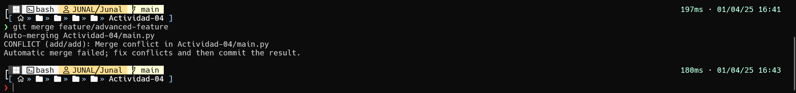

# **Actividad 4: Introduccion a Git - conceptos basicos y operaciones esenciales**


## **Preguntas:**
### **1. ¿De que manera Git te ha ayudado a mantener un historial estructurado y ordenado de tus cambios?**  

A lo largo de mis proyectos , tanto en este curso como en otros, Git ha sido una herramienta clave para organizar y gestionar el historial de cambios de manera eficiente. Algunas de las formas en que me ha beneficiado incluyen:  

- **Commits Descriptivos**: Cada modificacion en mi codigo va acompañada de un commit con un mensaje claro y detallado. Esto me permite entender posteriormente que cambios se realizaron y porque , facilitando la comprension del contexto en proyectos complejos  

- **Uso de Ramas (Branches)**: Trabajo con ramas para desarrollar nuevas funcionalidades o probar ideas sin afectar la rama principal (main). Esto me ayuda a mantener el codigo estable mientras experimento con mejoras o soluciones

- **Reversion de Cambios**: en ocasiones , he implementado cambios que generaron problemas. Gracias a Git, he podido revertirlos facilmente y restaurar una version anterior del codigo sin comprometer la estabilidad del proyecto  

- **Comparacion de Versiones (Diffs)**: Git me permite analizar las diferencias entre versiones del codigo, lo que resulta util para identificar la causa de errores o entender la evolucion de los cambios 

- **Colaboracion Eficiente**: cuando trabajo en equipo, Git facilita la coordinacion de cambios. Cada miembro puede hacer commits y fusionar su trabajo en una rama comun, permitiendo un seguimiento claro de las contribuciones y optimizando la revision del codigo.  

- **Etiquetado de Versiones Clave**: En algunos proyectos, utilizo etiquetas (tags) para marcar versiones importantes, como lanzamientos o hitos significativos. Esto simplifica la navegacion por el historial del proyecto y la gestion de versiones  

- **Respaldo y Acceso Remoto**: con plataformas como GitHub, puedo mantener copias remotas de mis proyectos. Esto no solo actua como respaldo en caso de fallos en mi equipo, sino que tambien me permite acceder a mi codigo desde cualquier lugar y colaborar con otros desarrolladores de manera sencilla


### **2. ¿Que ventajas encuentras en el uso de ramas para desarrollar nuevas funciones o corregir errores?**  

El uso de ramas en Git aporta multiples beneficios cuando se trabaja en el desarrollo de nuevas caracteristicas o en la correccion de errores. Algunas de sus ventajas clave incluyen :  

- **Aislamiento de Cambios**: Cada rama permite trabajar de manera independiente en una nueva funcionalidad o correccion sin afectar la rama principal (`main`). Esto garantiza que el codigo en produccion se mantenga estable mientras se implementan y prueban los cambios  

- **Trabajo en Paralelo**: Varios desarrolladores pueden trabajar simultaneamente en diferentes ramas sin interferir entre si. Esto facilita la colaboracion y permite avanzar en diversas tareas al mismo tiempo , optimizando la eficiencia del equipo  

- **Mayor Control de Calidad**: Al desarrollar en una rama separada, es posible realizar pruebas exhaustivas y revisiones de codigo antes de fusionar los cambios con la rama principal. Esto ayuda a prevenir la insercion de errores en el codigo estable  

- **Flexibilidad para Descartar Cambios**: Si una nueva funcionalidad o correccion no funciona como se esperaba, se puede eliminar la rama sin afectar el codigo base. Esto proporciona una gran seguridad y flexibilidad en el desarrollo  

- **Despliegues Independientes**: En proyectos con lanzamientos frecuentes, las ramas permiten preparar y probar versiones especificas de forma independiente. Una vez que una funcion esta lista, puede fusionarse y desplegarse sin depender de otros cambios en desarrollo

## **Ejercicios**

### **Ejercicio 1: Manejo avanzado de ramas y resolución de conflictos**

Primero configo git con mis credenciales
    

Para mi caso, yo manejo 2 cuentas github en mi laptop a travez de claves ssh, para este repositorio estare manejando la cuenta:

```bash
file:C:/Users/Junal/.gitconfig  user.email=chowdhurygomezjunaljohir@gmail.com
file:C:/Users/Junal/.gitconfig  user.name=JunalChowdhuryG
```

1. **Crear una nueva rama para una característica:**

    - Crea una nueva rama llamada feature/advanced-feature desde la rama main:

    ```git
    git branch feature/advanced-feature
    git checkout feature/advanced-feature       
    ```
    


2. **Modificar archivos en la nueva rama:**

    - Edita el archivo main.py para incluir una función adicional:

        El código agregado nos permite imprimer el mensaje `Hello from advanced feature` mediante la funcion **greet**

        

    - Añadimos y confirmamos estos cambios en la rama feature/advanced-feature:

        ```git
        git add main.py
        git commit -m "Add greet function in advanced feature"     
        ```

        

3. **Simular un desarrollo paralelo en la rama main:**

    - Cambia de nuevo a la rama main:

        ```git
        git checkout main  
        ```
    - Añade y confirma estos cambios en la rama main:

        ```git
        git add main.py
        git commit -m "Update main.py message in main branch"
        ```
    
    

4. **Intentamos fusionar la rama feature/advanced-feature en main:**

    - Fusiona la rama feature/advanced-feature en main:
        ```git
        git merge feature/advanced-feature
        ```
    Observamos que surgio un conflicto al momento de hacer un merge.

    

    Observamos que los prints creadas en el archivo python en las diferentes ramas se unen. 

    

5. **Resolver el conflicto de fusión:**

    - Git generará un conflicto en main.py. Abre el archivo y resuelve el conflicto manualmente,
    eligiendo cómo combinar las dos versiones.

    - Después de resolver el conflicto, añade el archivo resuelto y completa la fusión:

        ```git
        git add main.py
        git commit -m "Resolve merge conflict between main and feature/advanced-feature"
        ```
    

6. **Eliminar la rama fusionada:**
    - Una vez que hayas fusionado con éxito y resuelto los conflictos, elimina la rama
    feature/advanced-feature:

        ```git
        git branch -d feature/advanced-feature
        ```

    

### **Ejercicio 2: Exploración y manipulación del historial de commits**


1. **Ver el historial detallado de commits:**
   - Usa el comando `git log` para explorar el historial de commits, pero esta vez con más detalle:

     ```bash
     $ git log -p
     ```
    
    - Podemos parte del historial de commits


2. **Filtrar commits por autor:**
   - Usa el siguiente comando para mostrar solo los commits realizados por un autor específico:

     ```bash
     $ git log --author="TuNombre"
     ```
     
    - Podemoss ver els historial del author=`JunalChowdhuryG`

3. **Revertir un commit:**
   - Imagina que el commit más reciente en `main.py` no debería haberse hecho. Usa `git revert` para revertir ese commit:

     ```bash
     $ git revert HEAD
     ```
   
   - Revertimos la ultima modificacion del `main.py`

4. **Rebase interactivo:**
   - Realiza un rebase interactivo para combinar varios commits en uno solo. Esto es útil para limpiar el historial de commits antes de una fusión.
   - Usa el siguiente comando para empezar el rebase interactivo:

     ```bash
     $ git rebase -i HEAD~3
     ```
    - El comaando anterior abre en el editor:
    

    - Cambiamos los terminos  `pick` a `squach`
    

    - Vemos los cambios hechoss
    


5. **Visualización gráfica del historial:**
   - Usa el siguiente comando para ver una representación gráfica del historial de commits:

     ```bash
     $ git log --graph --oneline --all
     ```
    - visualizamos el git logs
   
   - otra manera de visualizar es con el comando `gitk --all`
   

### **Ejercicio 3: Creación y gestión de ramas desde commits específicos**
