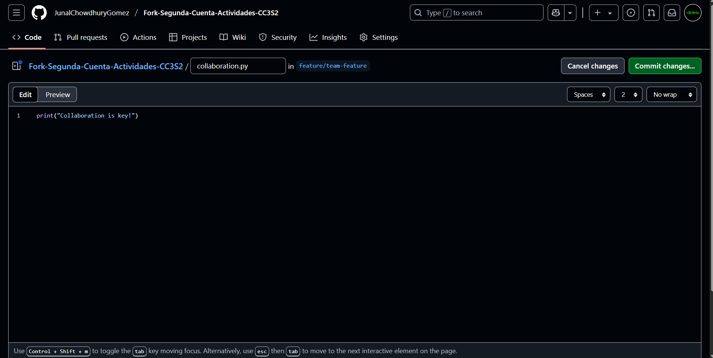

# **Actividad 5: Explorando diferentes formas de fusionar en Git**

## **Ejemplos**
### **1. Fusión Fast-forward (git merge --ff)**
1. Crear un nuevo repositorio

    ```shell
    $ mkdir prueba-fast-forward-merge
    $ cd prueba-fast-forward-merge
    $ git init
    ```
    


2. Agregar un archivo inicial en la rama principal (main)

    ```shell
    $ echo "# Mi Proyecto" > README.md
    $ git add README.md
    $ git commit -m "Commit inicial en main"
    ```

    - Crea el archivo
    

    - Se hace el primer `git commit`
    


3. Crear y cambiar a una nueva rama 'add-description'

    - Añade modificacion al `README.md` en la rama `add-description`
    ```shell
    $ git checkout -b add-description
    $ echo "Este proyecto es un ejemplo de cómo usar Git." >> README.md
    ```
    


4. Se comitea los cambios
    ```shell
    $ echo "Este proyecto es un ejemplo de cómo usar Git." >> README.md
    $ git add README.md
    $ git commit -m "Agregar descripción al README.md"
    ```
    

5. Cambiar de vuelta a la rama 'main' y realizar la fusión fast-forward
    ```shell
    $ git checkout main
    $ git merge add-description

    # Ver el historial lineal
    $ git log --graph --oneline
    ```
    

- **Pregunta:** Muestra la estructura de commits resultante.
    

### **2. Fusión No-fast-forward (git merge --no-ff)**

1. Creamos el repositorio


2. Agregar un archivo inicial en la rama principal (main)


3. Crear y cambiar a una nueva rama `add-feature`


4. Hacer cambios en la nueva rama y comitearlos


5. Cambiar de vuelta a la rama 'main' y realizar una fusión no-fast-forward


6. Ver el historial


### **3. Fusión squash (git merge --squash)**

1.  Crer un nuevo repositorio


2. Agregar un archivo inicial en la rama principal (main)


3. Crear y cambiar a una nueva rama `add-basic-files`


4. Hacer algunos cambios y comitearlos


    y otro cambio


5. Cambiar de vuelta a la rama `main` y realizar la fusión squash


6. Para completar la fusión squash, realiza un commit:


## **Ejercicios**

### **Ejercicio: Resolver conflictos en una fusión non-fast-forward**

1. Inicializa un nuevo repositorio


2. Crea un archivo index.html y realiza un commit en la rama main:


3. Crea y cambia a una nueva rama feature-update y realiza un commit en la rama feature-update


4. Regresa a la rama main y realiza una edición en el mismo archivo


6. Fusiona la rama feature-update con --no-ff y observa el conflicto


7. Solucion al conflicto y Vemos el  historial


**Preguntas:**
- ¿Qué pasos adicionales tuviste que tomar para resolver el conflicto?
    - Tuve que editar el archivo `index.html` manualmente, y elimine los bloques `<<<<<<< HEAD`, `==============`, `>>>>>>>>>>>>>>>>>>> feature-update`
- ¿Qué estrategias podrías emplear para evitar conflictos en futuros desarrollos colaborativos?
    - Revisar y entender el historial de cambios antes de hacer una fusion de reamas `merge`, con comandos como git log, git diff, o git status
    - Realizar revisiones de codigo antes de fusionar ramas
    - Usar ramas pequenas y de corta duracion , para que los merges sean mas simples y sean menos propensoss a tener conflictos

### **Ejercicio: Comparar los historiales con git log después de diferentes fusiones**

- Creamos el repositorio


- Modificamos el archivo en las ramas `main` y `feature-1`


- Hacemos commit en la rama `feature-2`


- Hacemos `merge` con la rama `feature-1`


- Hacemos `merge` con la rama `feature-2` y solucionamos el conflicto 


- Hacemos commit en la ram a `feature--3`


- Hacemos `merge squash` con la rama `feature--3`


- Generamos los graficos logs


Vemos que se hizo correctamente el `merge squash`

- **Preguntas:**
    - ¿Cómo se ve el historial en cada tipo de fusión?
        - Para el **fast-forward:** el historial se linela como si los commits se hubieran hecho en el `main`
        - Para el **Non-fast-forward** se ve una ramificacion  y un punto de union
        - Para el **squash** apesar de hubo varios commits, estos se comprimieron 

    - ¿Qué método prefieres en diferentes escenarios y por qué?
        - el **fast-forward:** cuando hay cambios simples como errores o documenteacion
        - el **Non-fast-forward** cuando la rama tiene multiples cambioss y necesito ver que fue parte de una sola funcionalidad especifica
        -  el **squash** para manterner historial limpio y no necestito detalle de cada commit

### **Ejercicio: Usando fusiones automáticas y revertir fusiones**

1. Iniciamos el repositorio


2. Hacemos 2 commits


3. Hacemos un commit adicional en la rama `auto-merge`


4. Cambiamos a `main` y hacemos un commit


5. Procedemos hacer el merge


6. Verificamos el historial


7. Para mas detalle utilizamos `gitk --all`


- **Preguntas:**
    - ¿Cuándo usarías un comando como `git revert` para deshacer una fusión?
        - cuando  hiciste un merge y te das cuenta de que fue un error
    - ¿Qué tan útil es la fusión automática en Git?
        - permite ahorrar tiempo cuando hay varias personas trabajando en distintas partess del codigo
        - permite unir ramas directamente siempre en cuando no exista conflictos


### **Ejercicio final: flujo de trabajo completo**

Este ejercicio es muy similar a uno de la Actividad 4: **Ejercicio 5: Trabajo colaborativo y manejo de Pull Requests** en donde procedo hacer una fusion apartir de un `pull request` hecho con otra cuenta (simulando un entorno colaborativo)

- Como mencione anteriormente, manejo 2 cuentas de github las cuales utilizare para hacer el Pull Request desde una cuenta a otra:

  - [JunalChowdhuryG (Principal): Actividades-CC3S2](https://github.com/JunalChowdhuryG/Actividades-CC3S2)  
  - [JunalChowdhuryGomez (Secundaria): Fork-Segunda-Cuenta-Actividades-CC3S2](https://github.com/JunalChowdhuryGomez/Fork-Segunda-Cuenta-Actividades-CC3S2)

- Repositorio de la cuenta **Principal** vista desde la cuenta **Secundaria**.


- Haciendo Fork del repositoria de la cuenta **Principal** en la cuenta **Secundaria**, el repositorio es: [JunalChowdhuryGomez/Fork-Segunda-Cuenta-Actividades-CC3S2](https://github.com/JunalChowdhuryGomez/Fork-Segunda-Cuenta-Actividades-CC3S2)


- Creo el archivo `collaboration.py` en la rama `feature/team-feature`  en el repositorio de la cuenta **Secundaria**


- Procedemos hacer el commit desde la segunda cuenta


- Preparamos el pull request desde la segunda cuenta


- Añadimos el mensaje al pull request 


- Confirmamos el envio del pull request desde la segunda cuenta


- En la cuenta **principal** verificamos el pull request


- Revisamos el pull request 


- Aceptamos el pull request desde la cuenta **Principal**


- Fusionamos a la rama main


- Verificamos que se fuciono la rama correctament, ademas podemo ver la contribucion de la segunda cuenta de github


- **Preguntas:**
    - ¿Cómo cambia la estrategia de fusión cuando colaboras con otras personas en un repositorio remoto?
        - Hacer constantemente `pull` y `fetch` para que la copia local este actualizada
        - revisarlos cambios antes de hacer una fusion
        - Coordinacion mas eficiente con tu equipo sabiendo que le toca a cada quien

    - ¿Qué problemas comunes pueden surgir al integrar ramas remotas?
        - dos o mas personas trabajan en la mismo archivo
        - si fusionas sin hacer pruebas puedes romper la rama principal
        - si haces un mal `merge` o `rebase` puedes complicar el historial
