# **Actividad 6: Rebase, Cherry-Pick y CI/CD en un entorno agil**

## **Parte 1: git rebase para mantener un historial lineal**

1. Crea un nuevo repositorio Git y dos ramas, main y new-feature:
```shell
$ mkdir prueba-git-rebase
$ cd prueba-git-rebase
$ git init
$ echo "# Mi Proyecto de Rebase" > README.md
$ git add README.md
$ git commit -m "Commit inicial en main"
```


2. Crea y cambia a la rama new-feature:
```shell
$ git checkout -b new-feature
$ echo "Esta es una nueva caracteristica." > NewFeature.md
$ git add NewFeature.md
$ git commit -m "Agregar nueva caracteristica"
```
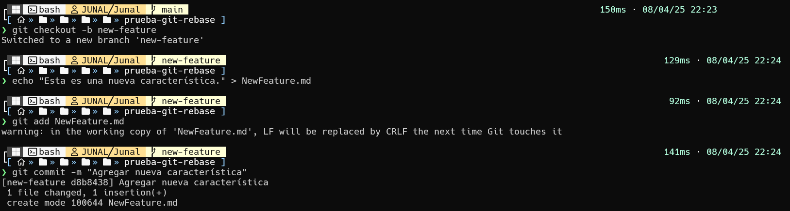


3. **Pregunta:** Presenta el historial de ramas obtenida hasta el momento.
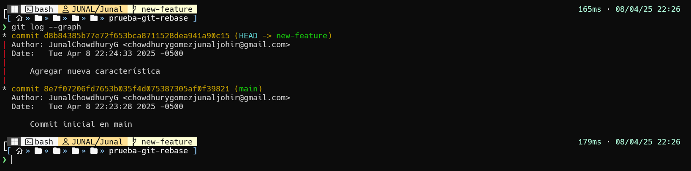


4. Ahora, digamos que se han agregado nuevos commits a main mientras trabajabas en new-feature:
```shell
# Cambiar de nuevo a 'main' y agregar nuevos commits
$ git checkout main
$ echo "Updates to the project." >> Updates.md
$ git add Updates.md
$ git commit -m "Update main"
```
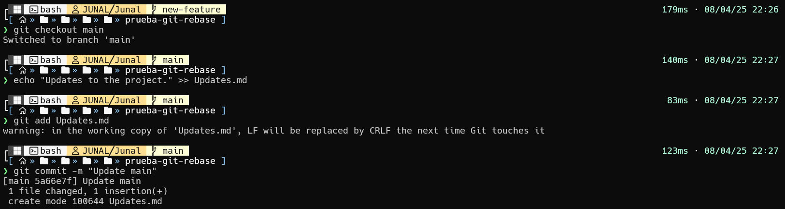


5. Tu grafico de commits ahora diverge (comprueba esto)
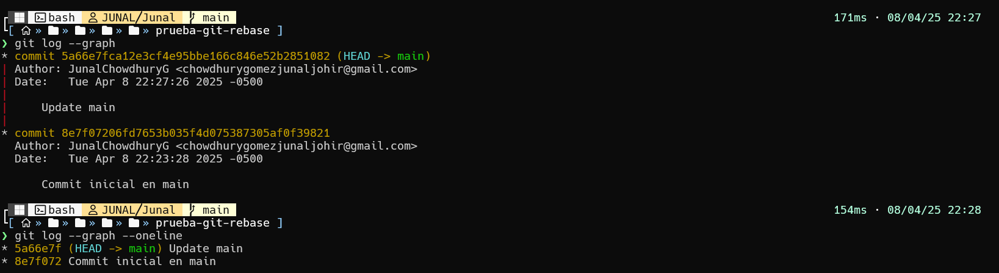


6. **Tarea:** Realiza el rebase de new-feature sobre main con los siguientes comandos:
```shell
$ git checkout new-feature
$ git rebase main
```
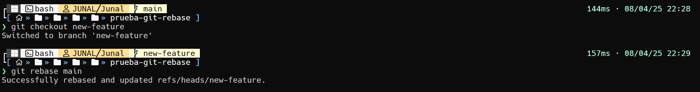

**Revision:**
7. Despues de realizar el rebase, visualiza el historial de commits con:
```shell
$ git log --graph –oneline
```
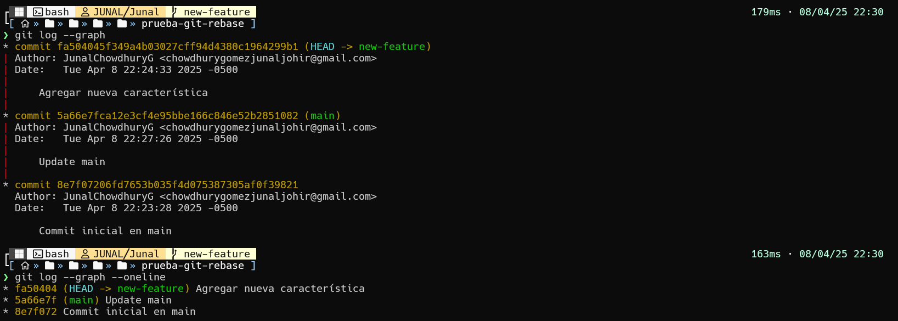

8. Momento de fusionar y completar el proceso de git rebase:
```shell
# Cambiar a 'main' y realizar una fusion fast-forward
$ git checkout main
$ git merge new-feature
```
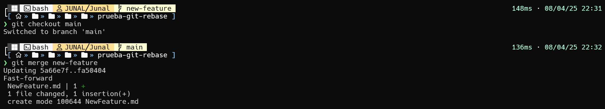
- Cuando se realiza una fusion fast-forward, las HEADs de las ramas main y new-feature seran los commits correspondientes.


## **Parte 2: git cherry-pick para la integracion selectiva de commit**

1. Iniciamos el repositorio
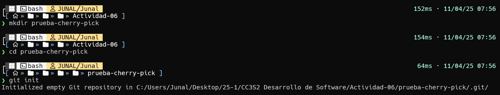

2. Hacemos un commit del archivo `README` en la rama `main`
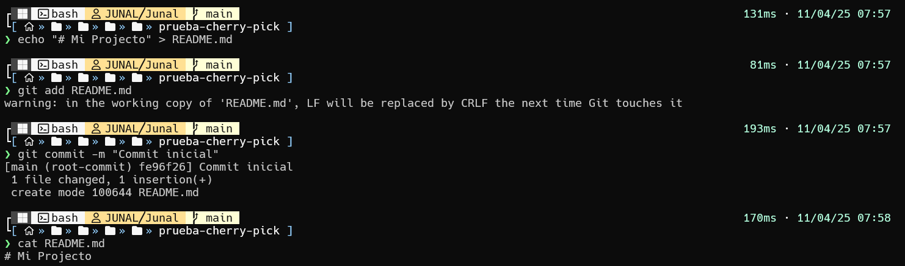

3. Cambiamos  a la rama `add-base-documents`
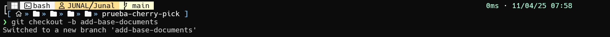

4. Hacemos un commit del archivo `CONTRIBUING` en la rama `add-base-documents`
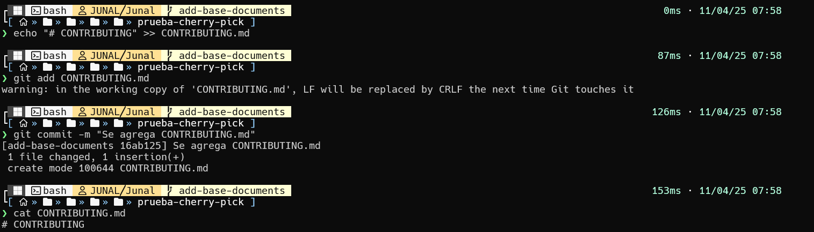

5. Hacemos un commit del archivo `LICENSE`


6. Verificamos el historial


7. Hacemos el `cherry-pick` al hash del commit del archivo `CONTRIBUING`
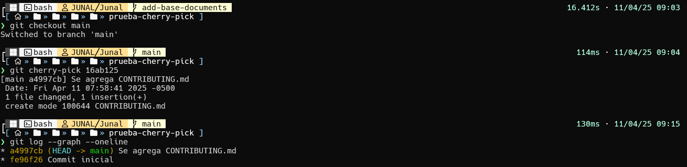

8. Visualizamos y comprovamos la ejcucion del `cherry-pick` 
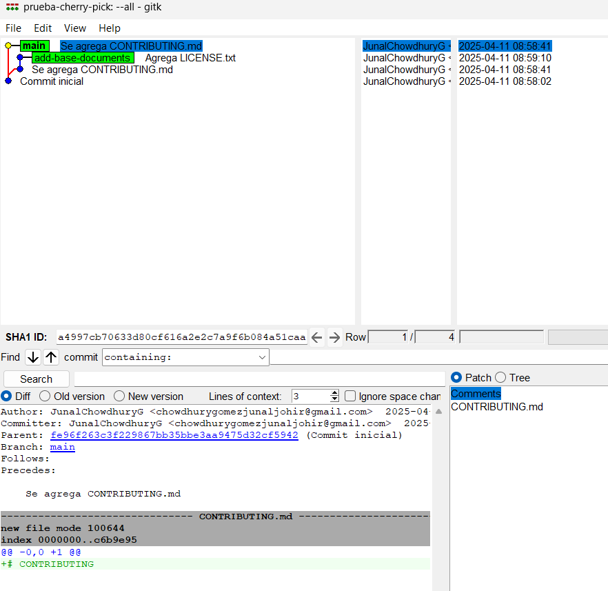

**Preguntas de discusion:**

- ¿Por que se considera que rebase es mas util para mantener un historial de proyecto lineal en comparacion con merge?
    - Rebase reescribe el historial y se sobrepone los commits sobre cierto punto base como si se huberan creados despues de el, esto hace que elhistorial sea mas facil de leer sin tantas bifurcaciones

- ¿Que problemas potenciales podrian surgir si haces rebase en una rama compartida con otros miembros del equipo?
    - si se hace un `rebase` en ramas compartidas y fuerzas un `push` los demas colaboradores podrian tener un historial distinto, ya que reescribistes el historial

- ¿En que se diferencia cherry-pick de merge, y en que situaciones preferirias uno sobre el otro?
    - `merge`
        - **Que hace?:** fusiona todo el historial en una rama
        - **Se usa, cuando:** quieres integrar todo
    - `cherry-pick`
        - **Que hace?:** trae commits especificos 
        - **Se usa, cuando:** solo quieres ciertas partes especificas

- ¿Por que es importante evitar hacer rebase en ramas publicas?
    - ya que `rebase` reescribe el historial, los demas colaboradores podrian tener un historial distinto y producirian conflictos


## **Ejercicios teoricos**

### **1. Diferencias entre git merge y git rebase**
**Pregunta: Explica la diferencia entre git merge y git rebase y describe en que escenarios seria mas adecuado utilizar cada uno en un equipo de desarrollo agil que sigue las practicas de Scrum.**
- **Merge**
    - sin modificar el historial combina el historial de 2 ramas haciendo un commit de merge
    - la mayor ventaja es que mantiene historial completo con bifurcaciones, y esto es util para auditar la historia del proyecto
    - la desventaja que puede tener es que con tantos merge el historial puede ser confuso
- **Rebase**
    - reescribe el historial, superponiendo commits sobre otra base, y no crea un commit de merge
    - la ventaja es que  mantiene un historial limpio y lineal, lo cual hace que sea de facil de leer
    - la desventaja es que si estas en un entorno de colaboracion, puede causar problemas si se comparte ramas entre los programadores
- **El uso en SCRUM**
    Es frecuente en SCRUM utilizar `merge` para integrar ramas de sprint a la main, y el `rebase` es utilizado localmente para tener un historial claro y limpio antes de subir cambios

### **2. Relacion entre git rebase y DevOps**
**Pregunta: ¿Como crees que el uso de git rebase ayuda a mejorar las practicas de DevOps, especialmente en la implementacion continua (CI/CD)? Discute los beneficios de mantener un historial lineal en el contexto de una entrega continua de codigo y la automatizacion de pipelines.**
- el `rebase` reescribe el historial de manera que los commits aparecen como si se hubieran hecho en la `main`, esto ayuda a tener un historial claro y limpio
- cuando se tiene un historial lineal, hay menos problemas de conflictos de fusion y eso ayuda a que los pipeline de CI puedan ejecutarse con facilidad
- Al tener un historial limpio y lineal, para los casos de falla en produccion sera mas facil identificar con exactitud en que punto del desrrollo se produjo el fallo


### **3. Impacto del git cherry-pick en un equipo Scrum**
**Pregunta: Un equipo Scrum ha finalizado un sprint, pero durante la integracion final a la rama principal (main) descubren que solo algunos commits especificos de la rama de una funcionalidad deben aplicarse a produccion. ¿Como podria ayudar git cherry-pick en este caso? Explica los beneficios y posibles complicaciones.**

- `cherry-pick` permite seleccionar commits especificos de una rama y aplicarlos a otra rama sin necesidad de mezclar toda la rama
- Los Beneficios son:
    - Es muy flexible para liberar lo necesario
    - Gracias al cherry-pick evitas hacer `merge` a cambios que aun no estan listos o que presentanb problemas
    - Para Scrum es beneficioso cuando hay entregas parciales o despliegues de imprevistos o urgentes
- las complicaciones que pueden suceder:
    - Es posible que suceda erores humanos como  equivocarse al seleccionar commits
    - duplica  el historial si se hace un merge de la rama completa 
    - puede que genere conflictos si los commits dependen de otros que no estan seleccionados

## **Ejercicios practicos**

### **1. Simulacion de un flujo de trabajo Scrum con git rebase y git merge**
1. Inicializar repositorio y hacer commit en main
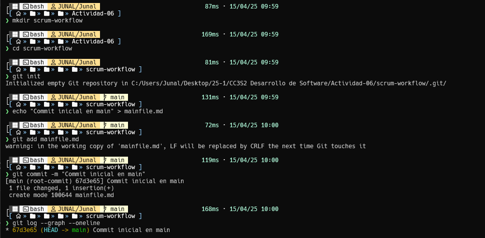

2. Crear rama feature y hacer un commit
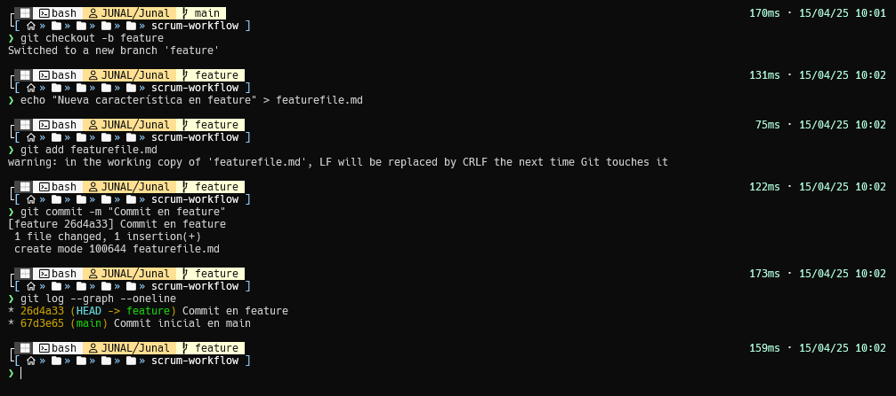

3. Volver a main y hacer un nuevo commit
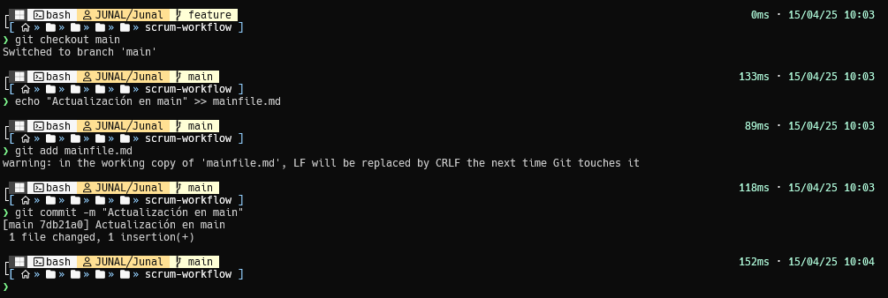

4. Rebase de feature sobre main
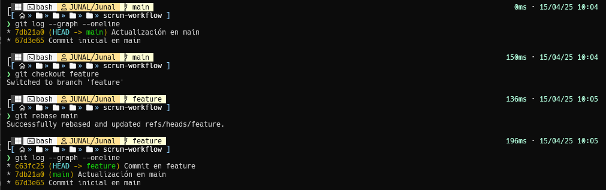

5. Fusion fast-forward
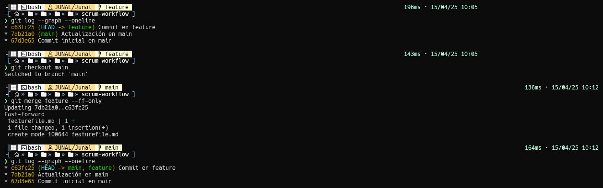

**Preguntas**
- **¿Que sucede con el historial de commits despues del rebase?**
    - El historial queda completamente lineal
- **¿Cuando aplicarias una fusion fast-forward en un proyecto agil?**
    - Si quiero manterner histtorial limpio y lineal
    - cuando hago un rebase en un `feature` sobre `main` antes de hacer merge
    - cuando quiero hacer un merge y no hay conflicto sin necesidad de un commit de merge

### **2. Cherry-pick para integracion selectiva en un pipeline CI/CD**

1. Crear el repositorio e inicializar rama main
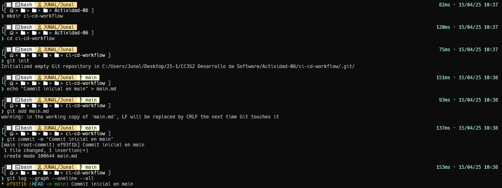

2. Crear rama feature y hacer varios commits
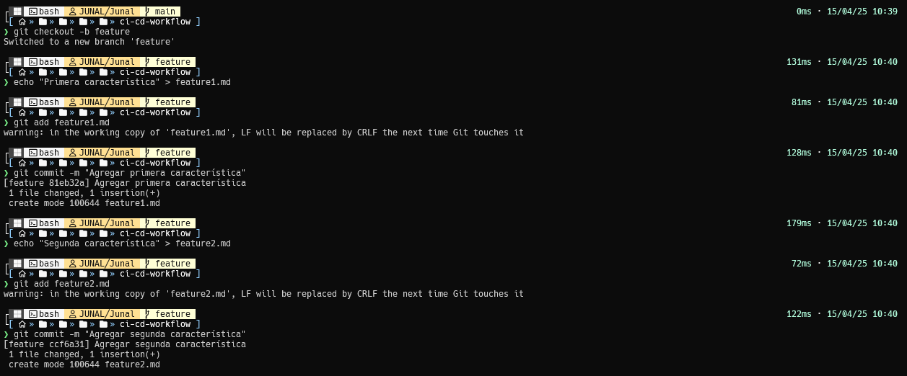

3. Ver los hashes de los commits
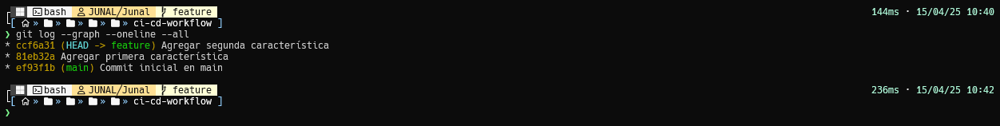

4. Hacer cherry-pick de los commits seleccionados
Supongamos que solo quieres mover la primera caracteristica a produccion por ahora:
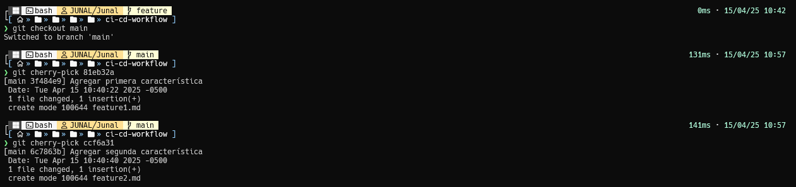

5. Verifica que los commits ahora estan en main
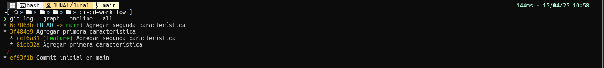

**Preguntas**
- **¿Como utilizarias cherry-pick en un pipeline de CI/CD para mover solo ciertos cambios listos a produccion?**
    Habiendo leeido  la lectura 10:
1. Identificar los commits aprobados
    Estos son marcados en la revision de codigo

2. Cambiar a la rama de produccion

    ```bash
    git checkout main
    ```

    - se procede hacer Cherry-pick los commits deseados

    ```bash
    git cherry-pick <commit_hash>
    # o cherry-pick a multipless commits
    git cherry-pick <hash1> <hash2> ...
    ```
    - Push a produccion
    ```bash
    git push origin main
    ```
    - Desencadenar el pipeline de produccion, la mayoria de pipelines estan configurados para ejecutarse al hacer push a main o release. Una vez el commit cherry-pickeado se encuentra en la rama, el pipeline se activa automaticamente


- **¿Que ventajas ofrece cherry-pick en un flujo de trabajo de DevOps?**
    - Despliegue selectivo y controlado  
        - Permite mover solo los commits que estan listos o aprobados desde una rama de desarrollo a produccion, sin la necesidad de hacer merge de todos los cambios
        - Ideal para entornos donde se trabaja con multiples ramas como develop, qa, staging, y main
    - correccion rapida de errores en produccion
        - Si se encuentra un bug critico en produccion, puedes arreglarlo en develop y luego cherry-pickear solo ese fix a main, sin traer otros cambios en progreso
    - historial limpio y entendible
        - Al evitar merges innecesarios, puedes mantener un historial mas claro, con commits que reflejan unicamente los cambios realmente desplegados

    - Colaboracion mas segura y eficienete entre equipos
        - En equipos grandes, distintos desarrolladores pueden trabajar en paralelo, y los DevOps pueden mover solo los cambios que han pasado QA o revision

## **Git, Scrum y Sprints**
### **Fase 1: Planificacion del sprint (sprint planning)**

1. Crear Repositorio
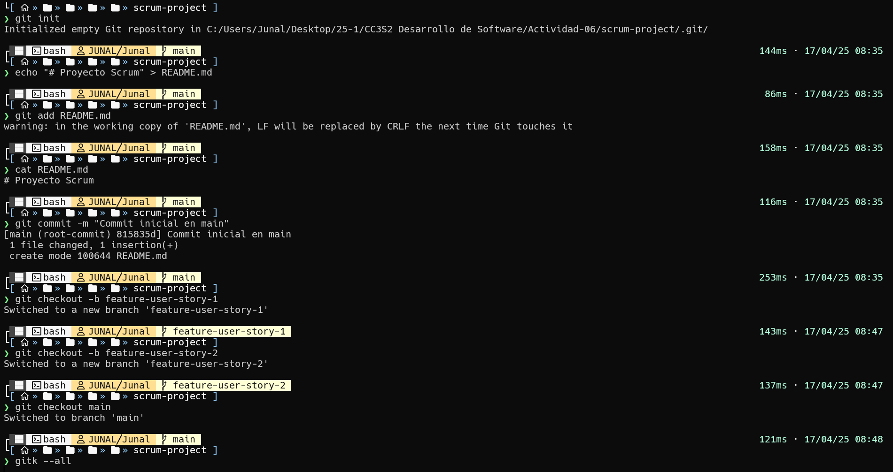

2. Vista de logs
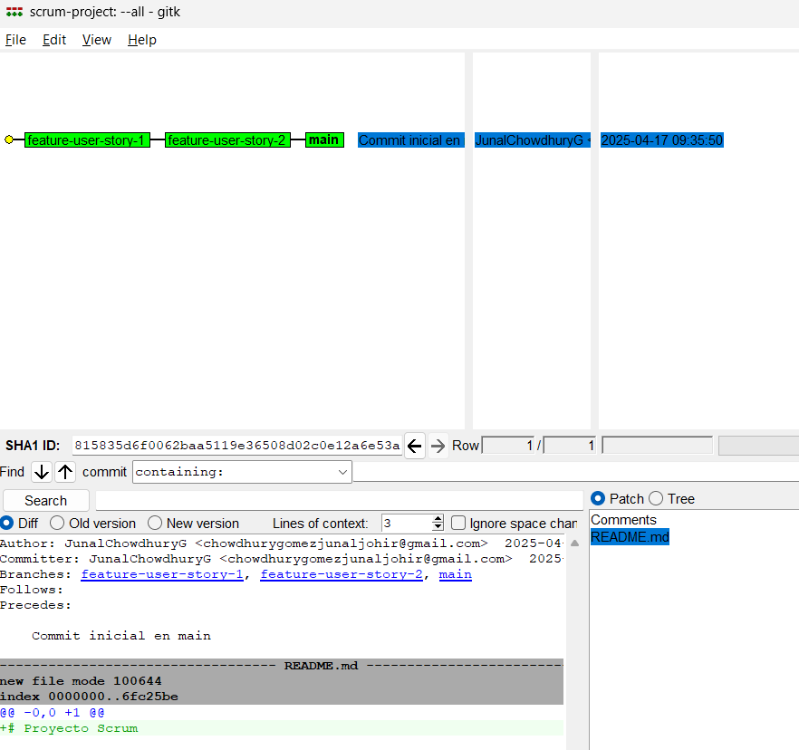

**Pregunta**
- **¿Por que es importante trabajar en ramas de funcionalidades separadas durante un sprint?**
    - Trabajar en ramas de funcionalidades sseparadas durante un sprint es importante para mantener un flujo de trabajo organizado, seguro y eficiente en un equipo que usa Scrum con Git, ya sea para:
        - **Aislar el trabajo:** Cada historia de usuario se desarrolla de forma independiente, lo que evita interferencias entre desarrolladores
        - **Mejor colaboracion en equipo:** Varios programadores pueden trabajar en paralelo sin pisarse los cambios
        - **Facilitacion de revertir cambios:** Si una historia de usuario no funciona o no se aprueba, puedes eliminar o revertir su rama sin afectar el resto del proyecto
        -  **Integracion controlada cuando se termine el  sprint:** al finalizar el sprint, puedes hacer merge solo de las ramas que cumplieron con la definicion de terminado , asegurando que solo funcionalidades completas lleguen a produccion o a staging

### **Fase 2: Desarrollo del sprint (sprint execution)**

1. Crear rpositorio
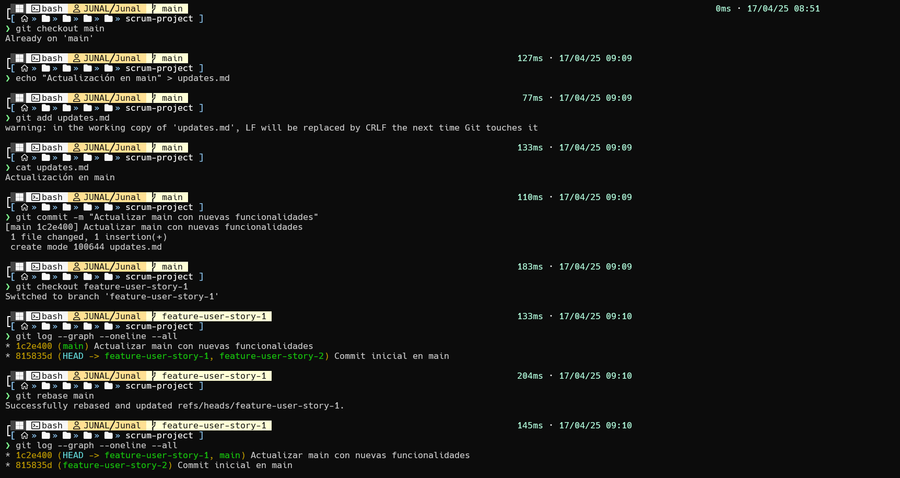

2. Vizualizar historial
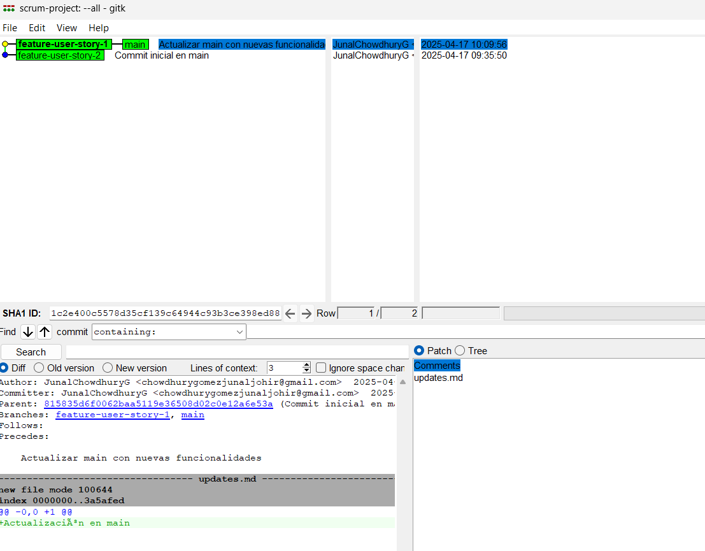


**Pregunta: ¿Que ventajas proporciona el rebase durante el desarrollo de un sprint en terminos de integracion continua?**
- Te ayuda a tener el historial mas limpio y lineal ya que los commits de tu historia de usuario se reorganizan como si hubieran sido creados despues de los ultimos de main
- Mejora la integracion continua (CI), cuando haces push tras un rebase, el sistema de CI/CD GitHub-Action ejecuta los tests sobre una version actualizada y alineada del codigo, lo que garantiza que la integracion sera mas confiable
- La revisiones de codigo son mas claras, Un rebase limpio ayuda a que los revisores vean solo tus cambios específicos, sin ruido de merges ni commits antiguos ya integrados.

### **Fase 3: Revision del sprint (sprint review)**

1. Crear rpositorio
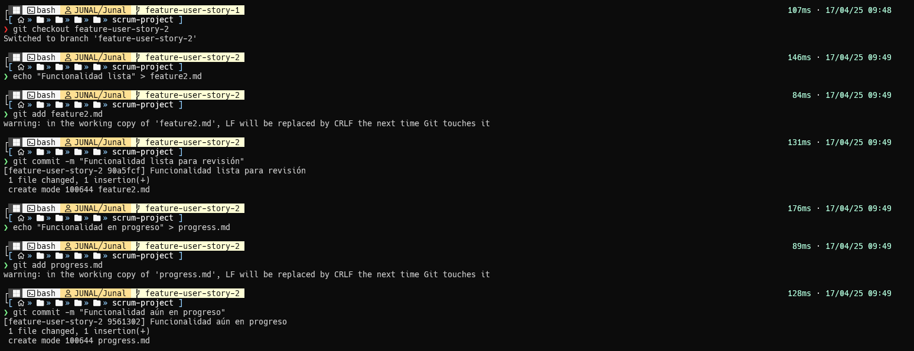

2. CHERRY-PICK
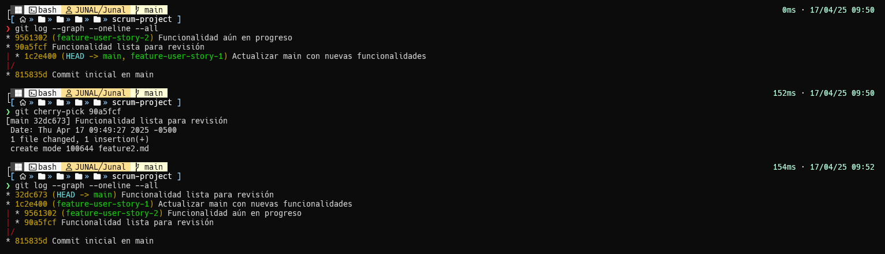

**Pregunta**
**Pregunta: ¿Como ayuda git `cherry-pick` a mostrar avances de forma selectiva en un sprint review?**
- Ayuda a tener una presentación precisa del trabajo terminado ya que solo Permite seleccionar solo los commits listos y funcionales desde una rama de desarrollo y llevarlos a main
- Tambien ayuda a evitar mezclar trabajo incompleto, ya que 
no necesitas hacer merge de toda la rama (que puede tener errores). Utilizazndo cherry-pick solo tomas los commits que cumplen con la definicion de `terminado`
- Tambien mejora la flexibilidad del equipo yaq que el equipo puede seguir trabajando en funcionalidades incompletas mientras comparte progresos parciales lo cual ayuda mantener la productividad y transparencia sin interrumpir el flujo de desarrollo

### **Fase 4: Retrospectiva del sprint (sprint retrospective)**

1. Crear rpositorio
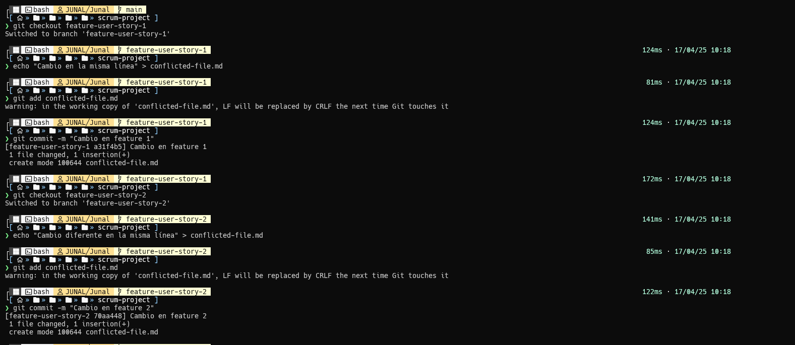

2. Primer merge
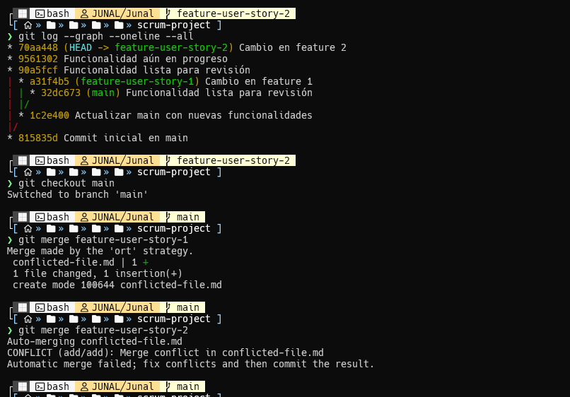

3. Segundo merge
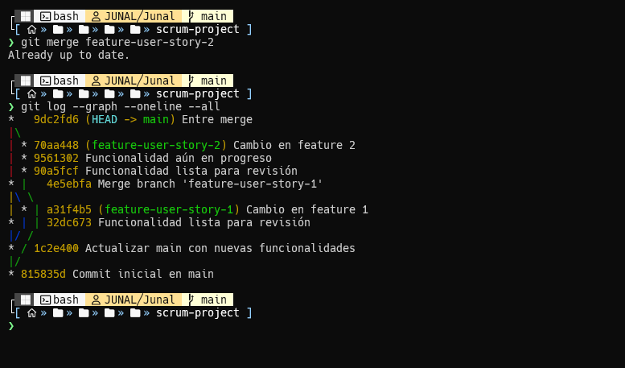

**Preguntas**
**¿Cómo manejas los conflictos de fusión al final de un sprint?**
- detectarlos al hacer git merge o git rebase
- leer cuidadosamente los archivos marcados con <<<<<<< <<<<<<< y >>>>>>>>>>
- editar y combinar los cambios de forma que no se pierda funcionalidad
- hacer git add y luego git commit para finalizar la solucion deel conflicto

**¿Cómo puede el equipo mejorar la comunicación para evitar conflictos grandes?**
- si se hace rebase frecuente desde main para evitar acumular diferencias grandes
- tambien avisar al equipo si se esta trabajando en archivos o modulos compartidos
- tambien dividir funcionalidades para que no muchas personas toquen los mismos archivos
- tambienn hacer code reviews tempranos

### **Fase 5: Fase de desarrollo, automatización de integración continua (CI) con git rebase**

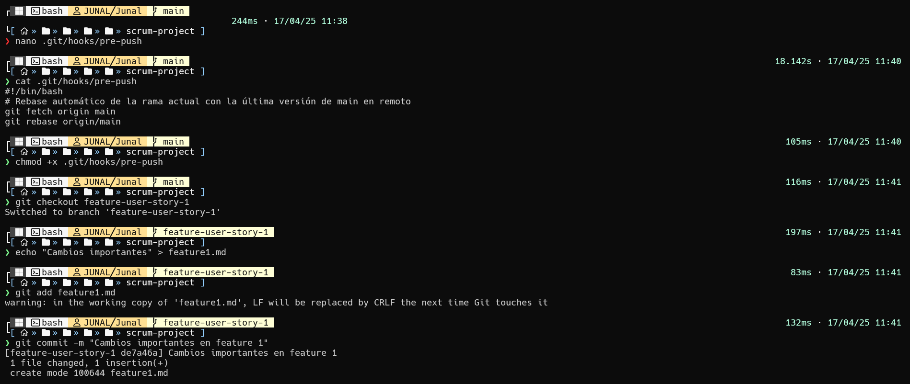

**Pregunta: ¿Qué ventajas y desventajas observas al automatizar el rebase en un entorno de CI/CD?**

**Ventadjas:**
- mantiene un historial lineal sin commits de merge innecesarios
- cuando sehace  rebase antes del push  se detectan conflictos antes de que el codigo llegue a github
- tambien  los PR o MR son mas claros ya que se basan directamente en la ultima version de main

**desventajas:**
-  si el rebase automatico encuentra conflictos , el push falla, y el progrmador debe resolverlos localmente
- tambien no es seguro para todos los equipos ya que en proyectos con varias ramas y colaboradores , un rebase mal manejado puede causar perdida de historial o confusión
- tambien complica el uso del push rapido, ya que el rebase toma tiempo , y si tienes varios cambios pequeños puede volverse molesto