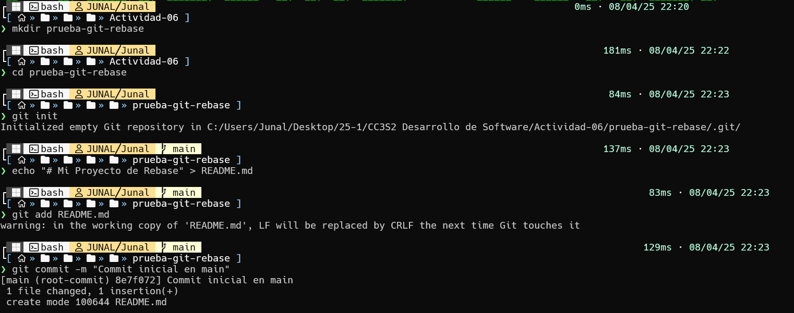

# **Actividad 6: Rebase, Cherry-Pick y CI/CD en un entorno ágil**

## **Parte 1: git rebase para mantener un historial lineal**

1. Crea un nuevo repositorio Git y dos ramas, main y new-feature:
```shell
$ mkdir prueba-git-rebase
$ cd prueba-git-rebase
$ git init
$ echo "# Mi Proyecto de Rebase" > README.md
$ git add README.md
$ git commit -m "Commit inicial en main"
```



2. Crea y cambia a la rama new-feature:
```shell
$ git checkout -b new-feature
$ echo "Esta es una nueva característica." > NewFeature.md
$ git add NewFeature.md
$ git commit -m "Agregar nueva característica"
```


3. **Pregunta:** Presenta el historial de ramas obtenida hasta el momento.


4. Ahora, digamos que se han agregado nuevos commits a main mientras trabajabas en new-feature:
```shell
# Cambiar de nuevo a 'main' y agregar nuevos commits
$ git checkout main
$ echo "Updates to the project." >> Updates.md
$ git add Updates.md
$ git commit -m "Update main"
```


5. Tu gráfico de commits ahora diverge (comprueba esto)


6. **Tarea:** Realiza el rebase de new-feature sobre main con los siguientes comandos:
```shell
$ git checkout new-feature
$ git rebase main
```


**Revisión:**
7. Después de realizar el rebase, visualiza el historial de commits con:
```shell
$ git log --graph –oneline
```


8. Momento de fusionar y completar el proceso de git rebase:
```shell
# Cambiar a 'main' y realizar una fusión fast-forward
$ git checkout main
$ git merge new-feature
```

- Cuando se realiza una fusión fast-forward, las HEADs de las ramas main y new-feature serán los commits correspondientes.