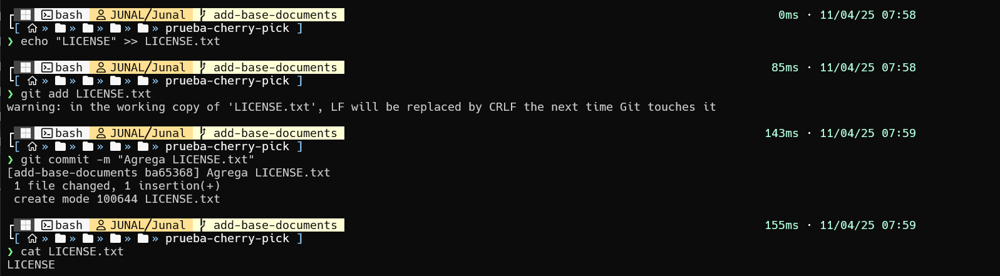
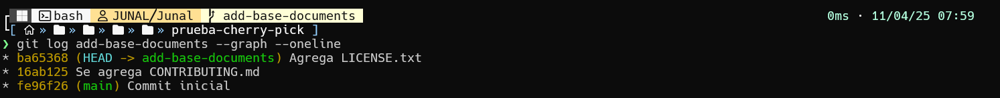

# **actividad 6: Rebase, Cherry-Pick y CI/CD en un entorno agil**

## **Parte 1: git rebase para mantener un historial lineal**

1. Crea un nuevo repositorio Git y dos ramas, main y new-feature:
```shell
$ mkdir prueba-git-rebase
$ cd prueba-git-rebase
$ git init
$ echo "# Mi Proyecto de Rebase" > REaDME.md
$ git add REaDME.md
$ git commit -m "Commit inicial en main"
```


2. Crea y cambia a la rama new-feature:
```shell
$ git checkout -b new-feature
$ echo "Esta es una nueva caracteristica." > NewFeature.md
$ git add NewFeature.md
$ git commit -m "agregar nueva caracteristica"
```


3. **Pregunta:** Presenta el historial de ramas obtenida hasta el momento.


4. ahora, digamos que se han agregado nuevos commits a main mientras trabajabas en new-feature:
```shell
# Cambiar de nuevo a 'main' y agregar nuevos commits
$ git checkout main
$ echo "Updates to the project." >> Updates.md
$ git add Updates.md
$ git commit -m "Update main"
```


5. Tu grafico de commits ahora diverge (comprueba esto)


6. **Tarea:** Realiza el rebase de new-feature sobre main con los siguientes comandos:
```shell
$ git checkout new-feature
$ git rebase main
```


**Revision:**
7. Despues de realizar el rebase, visualiza el historial de commits con:
```shell
$ git log --graph –oneline
```


8. Momento de fusionar y completar el proceso de git rebase:
```shell
# Cambiar a 'main' y realizar una fusion fast-forward
$ git checkout main
$ git merge new-feature
```

- Cuando se realiza una fusion fast-forward, las HEaDs de las ramas main y new-feature seran los commits correspondientes.


## **Parte 2: git cherry-pick para la integracion selectiva de commit**

1. Iniciamos el repositorio


2. Hacemos un commit del archivo `REaDME` en la rama `main`


3. Cambiamos  a la rama `add-base-documents`


4. Hacemos un commit del archivo `CONTRIBUING` en la rama `add-base-documents`


5. Hacemos un commit del archivo `LICENSE`


6. Verificamos el historial


7. Hacemos el `cherry-pick` al hash del commit del archivo `CONTRIBUING`


8. Visualizamos y comprovamos la ejcucion del `cherry-pick` 


**Preguntas de discusion:**

- **1. ¿Por que se considera que rebase es mas util para mantener un historial de proyecto lineal en comparacion con merge?**  
se considera mas util que un merge para mantener un historial de proyecto lineal yaa que reubica los commits de una rama sobre otra , evitando los commits de merge intermedios que aparecen al usar git merge.Esto hace tener un historial mas limpio y facil de leer esto ayuda:
    - facilita la depuracion  ya que se puede seguir facilmente la linea del tiempo de los cambios
    - simplifica las revisiones de codigo especialmente para desarrolladores que se incorporan despues
    - mejora la higiene del codigo porque permite reordenar, dividir o combinar commits antes de integrarlos en la rama main
    - esto es  util en entornos devops donde se prioriza la claridad y trazabilidad del codigo​


- **2. ¿Que problemas potenciales podrian surgir si haces rebase en una rama compartida con otros miembros del equipo?**


    - el problema de tener conflictos para colaboradores ya que si alguien hace rebase y sube la rama, los demas que ya habian trabajado sobre la version antigua tendran un historial diferente esto genera conflictos al intentar hacer push o pull

    - tambien se puede tener problesmas de fusiones complejas ya que al cambiar el historial de commits mediante rebase puede confundir a git al intentar fusionar ramas haciendo complicado reconciliar cambios

    - otro problema es la perrdida de contexto cuando al reordenar o aplastar commits con squash se puede perder informacion valiosa del proceso de desarrollo


- **3. ¿En que se diferencia cherry-pick de merge, y en que situaciones preferirias uno sobre el otro?**

    - el git merge: fusiona toda una rama con otra, manteniendo todo su historial
    - el git cherry-pick: selecciona commits especificos de una rama para aplicarlos en otra y  no integra toda la rama ni su historial completo  solo los cambios elegidos

    cuando se debe  usar uno o el  otro:

    - se usa merge cuando quieras traer todos los cambios de una rama sobretodo si esta  lista y alineada con los objetivos del proyecto.

    - se usa cherry-pick cuando necesites solo algunos commits especificos, como una correccion de bug o una funcionalidad puntual  sin introducir el resto de los cambios de la rama de origen

    esto es util cuando una rama contiene muchas modificaciones pero solo algunas son relevantes o estan listas para produccion


- **4. ¿Por que es importante evitar hacer rebase en ramas publicas?**
    - hay riesgo de conflictos al sincronizar cambios ya q si alguien mas ya ha clonado o hecho pull de la version original de la rama  al hacer rebase y forzar el push (--force) el historial cambia y entra en conflicto con el de los demas
    - tambien la dficultad para hacer merge posteriormente ya que git se basa en el historial de commits para fusionar ramas alterar ese historial complica la integracion con otras ramas
    - si no se maneja con cuidaddo el rebase en ramas compartidas puede producir bugs, confusion y perdida de productividad
    - tambien la regla de oro es: nunca hagas rebase en ramas publicas , solo se  hace en ramas locales o antes de compartir tu codigo con el equipo​


## **Ejercicios teoricos**

### **1. Diferencias entre git merge y git rebase**
**Pregunta: Explica la diferencia entre git merge y git rebase y describe en que escenarios seria mas adecuado utilizar cada uno en un equipo de desarrollo agil que sigue las practicas de Scrum.**
- **Merge**
    - sin modificar el historial combina el historial de 2 ramas haciendo un commit de merge
    - la mayor ventaja es que mantiene historial completo con bifurcaciones, y esto es util para auditar la historia del proyecto
    - la desventaja que puede tener es que con tantos merge el historial puede ser confuso
- **Rebase**
    - reescribe el historial, superponiendo commits sobre otra base, y no crea un commit de merge
    - la ventaja es que  mantiene un historial limpio y lineal, lo cual hace que sea de facil de leer
    - la desventaja es que si estas en un entorno de colaboracion, puede causar problemas si se comparte ramas entre los programadores
- **El uso en SCRUM**
    - git merge en SCRUM:
        * se puede utilizar cuando se desea conservar el historial completo de como se desarrollaron las features lo que es util para auditoria o trazabilidad completa del desarroll
        * tambien es ideal para equipos con desarrolladores de experiencia mixta por que que es mas seguro y menos propenso a errores
        * tambien cuando una rama de sprint o feature se fusiona a main al finalizar el sprint
    - git rebase en SCRUM:
        * durante el desarrollo individual en una rama local antes de hacer pull request o para limpiar commits innecesarios y ordenar el historial y facilitar la revision
        * tambien para preparar una rama antes de integrarla especialmente si se busca una fusin fast-forward
        * y tambien en equipos con fluidez en git donde se prioriza mantener el historial de commit limpio y lineal


### **2. Relacion entre git rebase y DevOps**
**Pregunta: ¿Como crees que el uso de git rebase ayuda a mejorar las practicas de DevOps, especialmente en la implementacion continua (CI/CD)? Discute los beneficios de mantener un historial lineal en el contexto de una entrega continua de codigo y la automatizacion de pipelines.**
git rebase es importante para mejorar las practicas de DevOps sobretodo en la entrega continua CI/CD  tambien ayuda:

* historial lineal: git rebase produce un historial limpio y sin bifurcaciones lo que ayuda en:
    - simplifica el seguimiento de errores con herramientas como git bisect o git blame 
    - tambien mejora la comprension del flujo de cambios por parte de otros desarrolladores

* ayuda a la automatizacion mas confiable con un historial ordenado y sin commits de merge innecesarios tambien facilita:
    
    - la ejecucion de pruebas automatizadas
    - la generacion de changelogs y reportes mas limpios y claros
    - el mantenimiento de pipelines de CI/CD son mas estables

* tambien facilita revisiones y auditorias por que  en DevOps donde la revision de codigo automatizada y manual es constante y un historial limpio acelera la deteccion de errores y asegura mejor calidad del codigo

### **3. Impacto del git cherry-pick en un equipo Scrum**
**Pregunta: Un equipo Scrum ha finalizado un sprint, pero durante la integracion final a la rama principal (main) descubren que solo algunos commits especificos de la rama de una funcionalidad deben aplicarse a produccion. ¿Como podria ayudar git cherry-pick en este caso? Explica los beneficios y posibles complicaciones.**

- `cherry-pick` permite seleccionar commits especificos de una rama y aplicarlos a otra rama sin necesidad de mezclar toda la rama
- los beneficios en scrum::
    * el beneficio del despliegue selectivo ya que puedes mover solo los commits estables o aprobados de la rama de desarrollo a producion
    * tambien evita el  despliegue de codigo incompleto o en superrevision
    * tambien reversion mas sencilla ya que si algo falla puedes revertir ese unico commit sin mover el resto del codigo
    * la flexibilidad postsprint ya que  si una funcionalidad no paso pruebas pero parte de ella si es util y otra parte no  puedes enviar solo la parte buena

- las complicaciones que pueden suceder son:
    - si los commits seleccionados dependen de otros que no les aplico cherry-pick podrian surgir conflictos o fallas
    - si al final se hace merge completo de la rama esos commits podrian repetirse ogenerar conflictos
    - apesar de que el historial en main se mantenga limpio  puede ser mas dificil ubicar el origen real del commit

## **Ejercicios practicos**

### **1. Simulacion de un flujo de trabajo Scrum con git rebase y git merge**
1. Inicializar repositorio y hacer commit en main


2. Crear rama feature y hacer un commit


3. Volver a main y hacer un nuevo commit


4. Rebase de feature sobre main


5. Fusion fast-forward


**Preguntas**
- **¿Que sucede con el historial de commits despues del rebase?**
después de hacer un git rebase  el historial de commits se reescribe  
Tambien:

* los commits de la rama que fue rebaseda se mueven a adelante de la rama base como si hubieran hecho después de esa rama base

* se generan nuevos hashs de commits ya que git considera que son commits completamente nuevos apesar de que el contenido sea el mismo

* el historial resultante es lineal osea no muestra bifurcacione o fusiones como en merge

* esto quiere decir visualmente parece que todos los cambios ocurrieron en una sola línea continua lo cual hace mejorar la legibilidad tambien facilita la depuración y ayuda a mantener un flujo de proyect mas limpio y ordeneado sobretodo cuando se usa  git log o git bisect


- **¿Cuando aplicarias una fusion fast-forward en un proyecto agil?**

    * la fusión fast forward ocurre cuando la rama  destino no ha tenido cambios desde que se bifurcó la rama de trabaj  lo que permite avanzar el puntero de la rama directamente sin crear commit de fucion
    
    * en un proyecto ágil:
        - cuando se trabaja en una rama de feature y deseas integrarla a main o develop sin generar commits de merge innecesarios
    * tambien es muy útil cuando:
        - la rama fue actualizada usando rebase sobre main
        - el equipo quiere mantener un historial lineal y limpio

la integración ocurre justo después de terminar el trabajo  sin que nadie más haya tocado la rama base


### **2. Cherry-pick para integracion selectiva en un pipeline CI/CD**

1. Crear el repositorio e inicializar rama main


2. Crear rama feature y hacer varios commits


3. Ver los hashes de los commits


4. Hacer cherry-pick de los commits seleccionados
Supongamos que solo quieres mover la primera caracteristica a produccion por ahora:


5. Verifica que los commits ahora estan en main


**Preguntas**
- **¿Como utilizarias cherry-pick en un pipeline de CI/CD para mover solo ciertos cambios listos a produccion?**
    Habiendo leeido  la lectura 10:
1. Identificar los commits aprobados
    Estos son marcados en la revision de codigo

2. Cambiar a la rama de produccion

    ```bash
    git checkout main
    ```

    - se procede hacer Cherry-pick los commits deseados

    ```bash
    git cherry-pick <commit_hash>
    # o cherry-pick a multipless commits
    git cherry-pick <hash1> <hash2> ...
    ```
    - Push a produccion
    ```bash
    git push origin main
    ```
    - Desencadenar el pipeline de produccion, la mayoria de pipelines estan configurados para ejecutarse al hacer push a main o release. Una vez el commit cherry-pickeado se encuentra en la rama, el pipeline se activa automaticamente


- **¿Que ventajas ofrece cherry-pick en un flujo de trabajo de DevOps?**
    - Despliegue selectivo y controlado  
        - Permite mover solo los commits que estan listos o aprobados desde una rama de desarrollo a produccion, sin la necesidad de hacer merge de todos los cambios
        - Ideal para entornos donde se trabaja con multiples ramas como develop, qa, staging, y main
    - correccion rapida de errores en produccion
        - Si se encuentra un bug critico en produccion, puedes arreglarlo en develop y luego cherry-pickear solo ese fix a main, sin traer otros cambios en progreso
    - historial limpio y entendible
        - al evitar merges innecesarios, puedes mantener un historial mas claro, con commits que reflejan unicamente los cambios realmente desplegados

    - Colaboracion mas segura y eficienete entre equipos
        - En equipos grandes, distintos desarrolladores pueden trabajar en paralelo, y los DevOps pueden mover solo los cambios que han pasado Qa o revision

## **Git, Scrum y Sprints**
### **Fase 1: Planificacion del sprint (sprint planning)**

1. Crear Repositorio


2. Vista de logs


**Pregunta**
- **¿Por que es importante trabajar en ramas de funcionalidades separadas durante un sprint?**
    - Trabajar en ramas de funcionalidades sseparadas durante un sprint es importante para mantener un flujo de trabajo organizado, seguro y eficiente en un equipo que usa Scrum con Git, ya sea para:
        - **aislar el trabajo:** Cada historia de usuario se desarrolla de forma independiente, lo que evita interferencias entre desarrolladores
        - **Mejor colaboracion en equipo:** Varios programadores pueden trabajar en paralelo sin pisarse los cambios
        - **Facilitacion de revertir cambios:** Si una historia de usuario no funciona o no se aprueba, puedes eliminar o revertir su rama sin afectar el resto del proyecto
        -  **Integracion controlada cuando se termine el  sprint:** al finalizar el sprint, puedes hacer merge solo de las ramas que cumplieron con la definicion de terminado , asegurando que solo funcionalidades completas lleguen a produccion o a staging

### **Fase 2: Desarrollo del sprint (sprint execution)**

1. Crear rpositorio


2. Vizualizar historial


**Pregunta: ¿Que ventajas proporciona el rebase durante el desarrollo de un sprint en terminos de integracion continua?**
- Te ayuda a tener el historial mas limpio y lineal ya que los commits de tu historia de usuario se reorganizan como si hubieran sido creados despues de los ultimos de main
- Mejora la integracion continua (CI), cuando haces push tras un rebase, el sistema de CI/CD GitHub-action ejecuta los tests sobre una version actualizada y alineada del codigo, lo que garantiza que la integracion sera mas confiable
- La revisiones de codigo son mas claras, Un rebase limpio ayuda a que los revisores vean solo tus cambios especificos, sin ruido de merges ni commits antiguos ya integrados.

### **Fase 3: Revision del sprint (sprint review)**

1. Crear rpositorio


2. CHERRY-PICK


**Pregunta**
**Pregunta: ¿Como ayuda git `cherry-pick` a mostrar avances de forma selectiva en un sprint review?**
- ayuda a tener una presentacion precisa del trabajo terminado ya que solo Permite seleccionar solo los commits listos y funcionales desde una rama de desarrollo y llevarlos a main
- Tambien ayuda a evitar mezclar trabajo incompleto, ya que 
no necesitas hacer merge de toda la rama (que puede tener errores). Utilizazndo cherry-pick solo tomas los commits que cumplen con la definicion de `terminado`
- Tambien mejora la flexibilidad del equipo yaq que el equipo puede seguir trabajando en funcionalidades incompletas mientras comparte progresos parciales lo cual ayuda mantener la productividad y transparencia sin interrumpir el flujo de desarrollo

### **Fase 4: Retrospectiva del sprint (sprint retrospective)**

1. Crear rpositorio


2. Primer merge


3. Segundo merge


**Preguntas**
**¿Como manejas los conflictos de fusion al final de un sprint?**

- detectarlos al hacer git merge o git rebase
- leer cuidadosamente los archivos marcados con <<<<<<< <<<<<<< y >>>>>>>>>>
- editar y combinar los cambios de forma que no se pierda funcionalidad
- hacer git add y luego git commit para finalizar la solucion deel conflicto

**¿Como puede el equipo mejorar la comunicacion para evitar conflictos grandes?**
-  en la planificación del sprint se divide las tareas de manera que minimicen la superposición de archivos entre los miembros del equipo
- tambien trabajar en ramas separadas por historia o funcionalidad esto evita trabajar directamente sobre la rama main

- tambien sincronizar los cambios con frecuencia permite detectar conflictos temprano cuando son más fáciles de solucionar
- los pull requests también sirven para detectar posibles conflictos antes de fusionar


### **Fase 5: Fase de desarrollo, automatizacion de integracion continua (CI) con git rebase**


**Pregunta: ¿Que ventajas y desventajas observas al automatizar el rebase en un entorno de CI/CD?**

**Ventadjas:**
- mantiene un historial lineal sin commits de merge innecesarios
- cuando sehace  rebase antes del push  se detectan conflictos antes de que el codigo llegue a github
- tambien  los PR o MR son mas claros ya que se basan directamente en la ultima version de main
- un historial lineal hace que  git bisect o git blame funcionen de forma más precisa y rápida
- si se configura bien  una automatizacion puede seguir reglas estrictas y coherentes que aseguren que siempre se haga rebase desde ramas actualizadas
- los cambios se prueban con la base de código más reciente  lo que disminuye el riesgo de conflictos ocultos o builds rotas después de un merge

**desventajas:**
-  si el rebase automatico encuentra conflictos , el push falla, y el progrmador debe resolverlos localmente
- tambien no es seguro para todos los equipos ya que en proyectos con varias ramas y colaboradores , un rebase mal manejado puede causar perdida de historial o confusion
- tambien complica el uso del push rapido  ya que el rebase toma tiempo , y si tienes varios cambios pequeños puede volverse molesto
- sise hace rebase automático de ramas públicas  puedes introducir conflictos para otros desarrolladores que ya estén trabajando sobre esa base
- Configurar correctamente la automatización de rebase  requiere cuidado, testing, y buen manejo de errores
