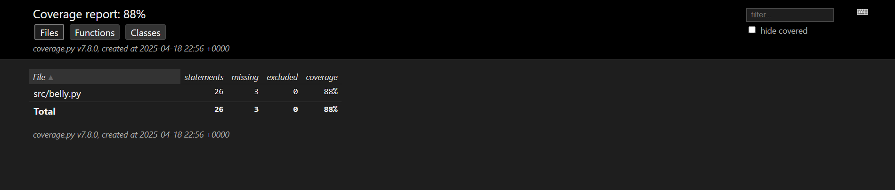

# Actividad 7: Pruebas BDD con behave

## Evidencia de Cumplimiento del Workflow CI/CD

### 1. Validacion del Workflow
- **Check del Workflow**: Ejecucion exitosa del pipeline en GitHub Actions.  
  

---

### 2. Ejecucion de Jobs
- **Jobs completados**: Todos los pasos del workflow finalizaron sin errores.  
  

---

### 3. Pruebas Unitarias y Calidad de Codigo
- **Tests unitarios**: 11/11 tests pasaron exitosamente.  
- **Flake8**: Cumplimiento de estandares PEP 8.  
  

---

### 4. Pruebas de Comportamiento (Behave)
- **Scenarios**: 15/15 scenarios pasaron (BDD).  
- **Reportes generados**:  
  - Reporte HTML de Behave.  
  - Reporte de cobertura (HTML).  
  

---

### 5. Artefactos Generados
- **Almacenamiento**: Reportes guardados como artefactos en GitHub Actions.  
  

---

### 6. Reporte XML de Behave
- **Integracion**: Archivo XML generado para herramientas externas.  
  

---

### 7. Cobertura de Codigo
- **Metrica**: 88% de cobertura (reporte HTML disponible).  
  

---

### Detalles Tecnicos
| **Metrica**          | **Resultado**       |
|----------------------|---------------------|
| Tests unitarios      | 11/11 pasados       |
| Scenarios Behave     | 15/15 exitosos      |
| Cobertura de codigo  | 88%                 |
| Cumplimiento Flake8  |  Sin errores       |

## Cumplimiento de ejercicios

| ejercicio | Descripcion | implementado en |
|----------:|-------------|------------------|
| 1         | Comportamiento basico: comer, esperar, gruñir | `belly.feature`, `Belly`, `steps.py` |
| 2         | Manejo de valores fraccionarios | `belly.feature`, `steps.py`, `test_belly.py` |
| 3         | Soporte multilenguaje (ingles y español) | `steps.py` |
| 4         | Manejo de valores aleatorios | `steps.py` |
| 5         | Validaciones: valores negativos y extremos | `belly.feature`, `Belly`, `test_belly.py` |
| 6         | Metodo para obtener total de pepinos comidos | `Belly`, `steps.py` |
| 7         | Parsing avanzado: horas, minutos, segundos | `steps.py`, `belly.feature` |
| 8         | Refactorizacion de codigo en Belly | `belly.py` |
| 9         | Separacion clara entre logica, pruebas y pasos | Carpeta `src/`, `tests/`, `features/` |
| 10        | Pruebas unitarias con Pytest (TDD) | `test_belly.py` (10 pruebas) |
| 11        | Escenarios de BDD (15 escenarios) | `belly.feature` |
| 12        | Prediccion de gruñido con inputs simulados | `Belly.predecir_gruñido()`, `steps.py` |
| 13        | Saber cuantos pepinos faltan para gruñir | `Belly.pepinos_para_gruñir()`, `steps.py` |
| 14        | Uso de reloj mockeado (fake clock) | `environment.py` |
| 15        | Pipeline de CI/CD con reportes | `.github/workflows/python.yml` |

