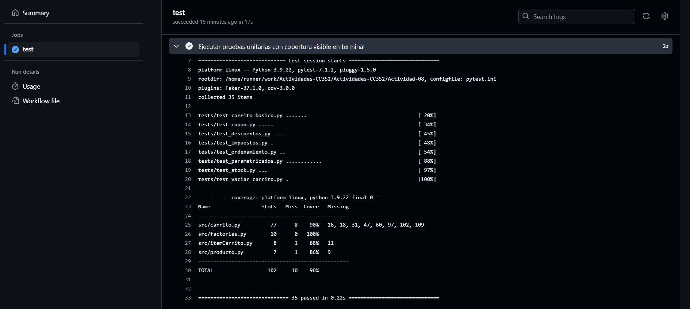
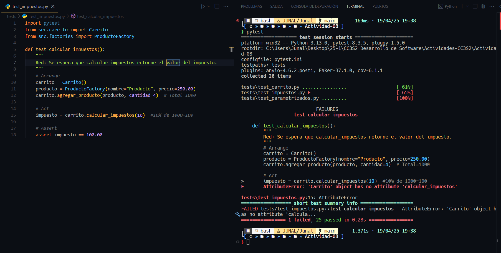
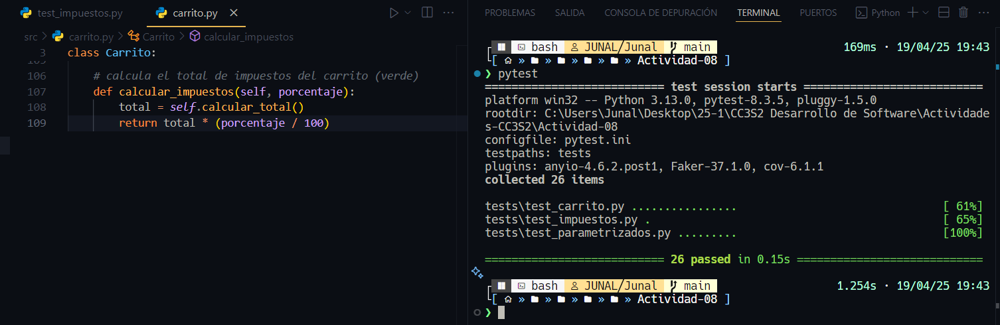
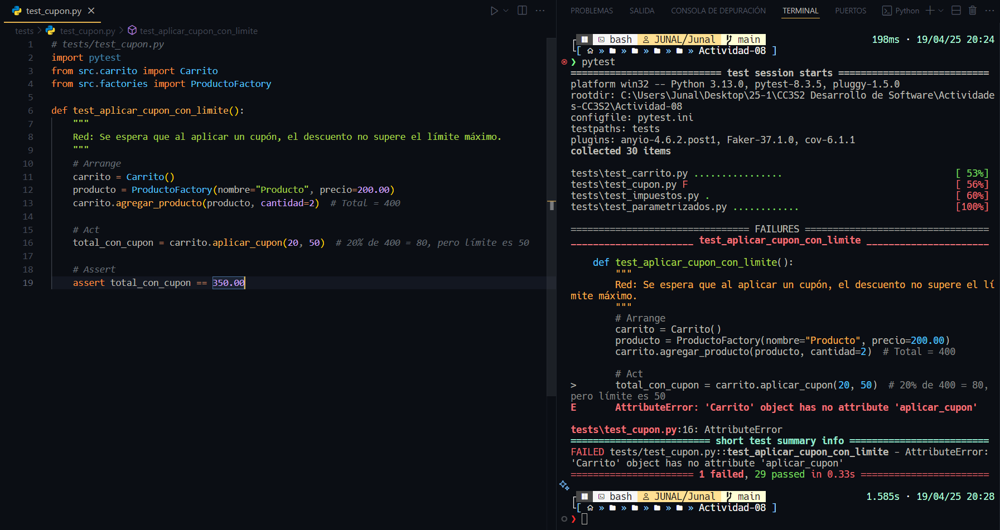
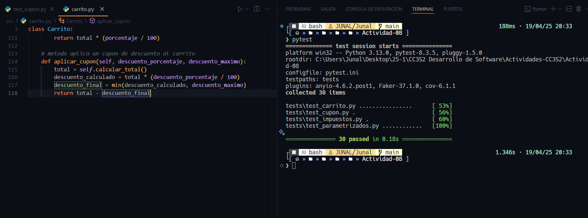
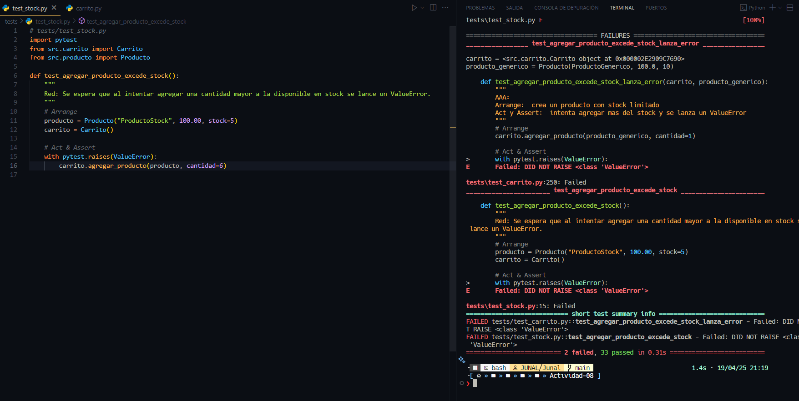
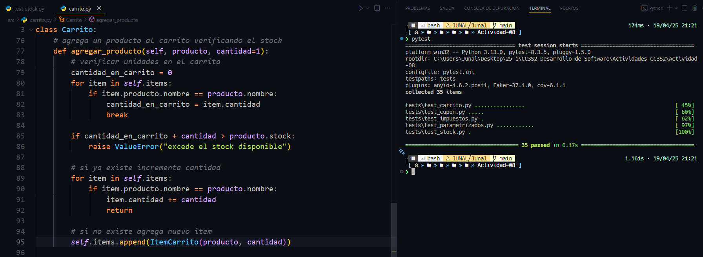
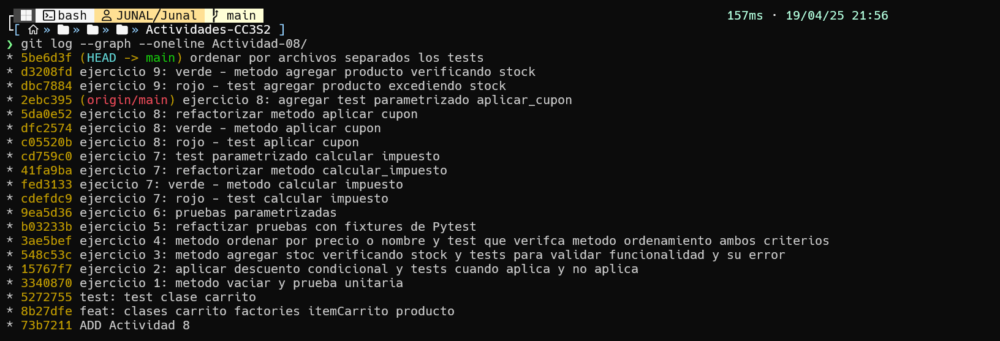

# **Actividad 8: El patrón Arrange-Act-Assert**
`Chowdhury Gomez, Junal`
## **1. Pruebas Unitarias y Cobertura de Codigo**
- **Tests unitarios**: **35/35** tests pasaron exitosamente con una cobertura de **90%**
  

--- 

## **2. Ejercicios completados**

| **Ejercicio** | **Archivo(s) de pruebas**                   | **Contenido resumido**                                                                 |
|-----------|------------------------------------------|-------------------------------------------------------------------------------------|
| **E1. Vaciar carrito**                     | `test_vaciar_carrito.py`                   | Implementa el método `vaciar()` y prueba que el carrito quede sin items ni total. |
| **E2. Descuento condicional**             | `test_descuentos.py`                       | Aplica un descuento si el total ≥ mínimo, con pruebas para ambos escenarios.      |
| **E3. Manejo de stock**                   | `test_stock.py`                            | Agrega verificación del stock en `agregar_producto` y pruebas para límite/errores.|
| **E4. Ordenar items**                     | `test_ordenamiento.py`                     | Método `obtener_items_ordenados()` para ordenar por `nombre` o `precio`.          |
| **E5. Uso de fixtures**                   | `conftest.py`                              | Fixtures para `Carrito` y `Producto` reutilizados en varias pruebas.              |
| **E6. Pruebas parametrizadas**           | `test_parametrizados.py`                   | Descuento, cantidad, impuestos y cupones con múltiples escenarios (`@parametrize`).|
| **E7. Calcular impuestos (RGR)**             | `test_impuestos.py`                        | Método `calcular_impuestos()` y validaciones de porcentaje.                       |
| **E8. Cupon con límite máximo (RGR)**      | `test_cupon.py`                            | Método `aplicar_cupon()` limita el descuento aplicado a un máximo permitido.      |
| **E9. Validación extra de stock (RGR)** | `test_stock.py`                            | Refuerzo de validación al agregar productos, usando Red-Green-Refactor.           |

## **3. Evidencia de los ejercicios RED - GREEN**

### **E7. RED - GREEN Calcular impuestos**

1. **(RED) Escribir la prueba que falla:**

2. **(GREEN) Implementar el código mínimo:**

### **E8. RED - GREEN Cupon con limite maximo**

1. **(RED) Escribir la prueba que falla:**

2. **(GREEN) Implementar el código mínimo:**

### **E9. RED - GREEN Validación extra de stock**

1. **(RED) Escribir la prueba que falla:**

2. **(GREEN) Implementar el código mínimo:**

## **4. Historial de los ejercicios**

## **5. Detalles Tecnicos**
| **Metrica**          | **Resultado**       |
|----------------------|---------------------|
| Tests unitarios      | 35/35 pasados       |
| Cobertura de codigo  | 90%                 |

