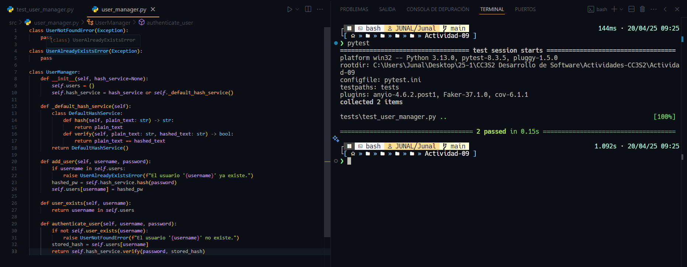
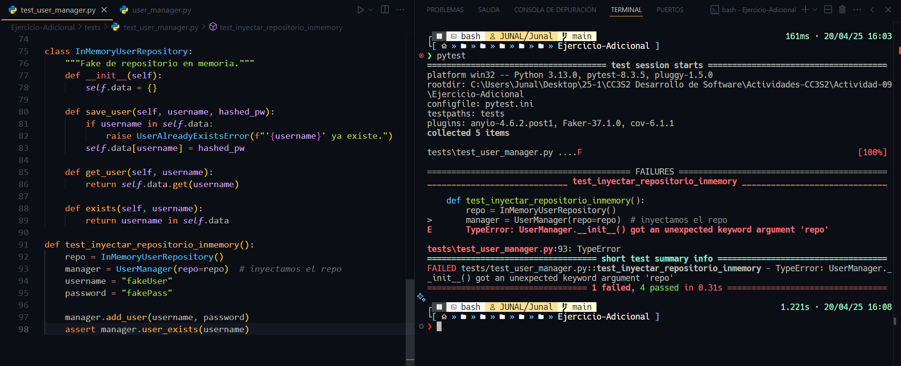

# **Actividad 9: Red-Green-Refactor**

## **Ejercicio**
Desarrolla las 6 iteraciones de Desarrollo Guiado por Pruebas (TDD) (Red-Green-Refactor) aplicadas a la clase UserManager, incluyendo casos de mocks, stubs, fakes, spies e inyección de dependencias. Cada iteración presenta un escenario diferente para ilustrar cómo podrías usar estas técnicas.

### **Historial de Commits del proceso Red-Green-Refactor con 6 iteraciones**

### **Iteración 1: Agregar usuario (Básico)**

#### **Paso 1 (Red): Escribimos la primera prueba**

#### **Paso 2 (Green): Implementamos lo mínimo para que pase la prueba**

### **Iteración 2: Autenticación de usuario (Introducción de una dependencia para Hashing)**

#### **Paso 1 (Red): Escribimos la prueba**

#### **Paso 2 (Green): Implementamos la funcionalidad y la DI**

### **Iteración 3: Uso de un Mock para verificar llamadas (Spy / Mock)**

#### **Paso 1 (Red): Escribimos la prueba de "espionaje"**

#### **Paso 2 (Green): Probar que todo pasa**
Realmente, nuestro código ya llama a `hash_service.hash`. Si ejecutamos pytest, la prueba debería pasar de inmediato, pues la implementación actual ya cumple la expectativa.

### **Iteración 4: Excepción al agregar usuario existente (Stubs/más pruebas negativas)**

#### **Paso 1 (Red): Prueba**

#### **Paso 2 (Green)**
Nuestra lógica ya lanza `UserAlreadyExistsError` si `user_exists` devuelve `True`. Así que la prueba debería pasar sin modificar el código.

### **Iteración 5: Agregar un "Fake" repositorio de datos (Inyección de Dependencias)**

#### **Paso 1 (Red): Nueva prueba**

#### **Paso 2 (Green): Implementación**

### **Iteración 6: Introducir un “Spy” de notificaciones (Envío de correo)**

#### **Paso 1 (Red): Prueba**

#### **Paso 2 (Green): Implementamos la llamada al servicio de correo**

## **Ejericicio Adicional**

### **Iteración 1: Agregar usuario (Básico)**

#### **Paso 1 (Red): Primera prueba**

#### **Paso 2 (Green): Implementamos lo mínimo**

### **Iteración 2: Autenticación con inyección de un servicio de Hashing (Fake)**

#### **Paso 1 (Red): Nueva prueba**

#### **Paso 2 (Green): Implementación con inyección de hash_service**

### **Iteración 3: Uso de un Mock/Spy para verificar llamadas internas**

#### **Paso 1 (Red): Prueba con Spy**

#### **Paso 2 (Green)**
Nuestra implementación ya invoca `hash(...)`, así que al correr `pytest` debería pasar sin cambios.

### **Iteración 4: Uso de Stubs para forzar comportamientos**

#### **Paso 1 (Red): Prueba**

#### **Paso 2 (Green)**
Ya tenemos en `add_user` la lógica que lanza la excepción si existe el usuario. Nuestra subclase “stub” fuerza esa condición. La prueba debe pasar de inmediato.

### **Iteración 5: Inyección de un repositorio (Fake)**

#### **Paso 1 (Red): Prueba con un repositorio fake**

#### **Paso 2 (Green): Implementación**

### **Iteración 6: Spy de Servicio de Correo**

#### **Paso 1 (Red): Prueba**

#### **Paso 2 (Green): Implementamos en `UserManager`**

