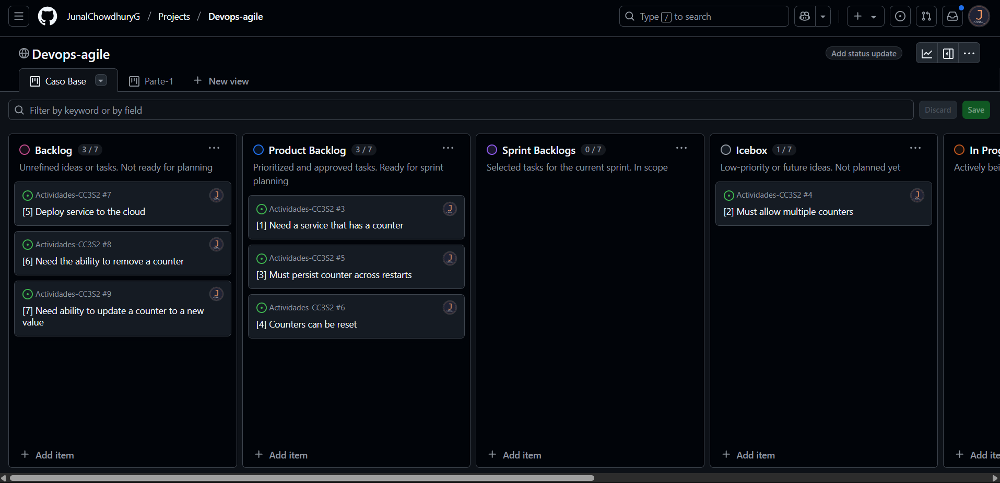

# **Actividades 17 y 18**
# Actividad 17: Gestion agil de Proyectos con GitHub Projects

Este documento describe la realizacion de la **Actividad 17**, enfocada en la configuracion de un tablero Kanban en GitHub Projects, la creacion de plantillas de issues, la generacion de historias de usuario, y la priorizacion y refinamiento del product backlog. La actividad fue completada por el **Grupo 2** en el repositorio [Actividad-17-18-Grupal](https://github.com/JunalChowdhuryG/Actividad-17-18-Grupal) a traves de una reunion virtual.

El tablero Kanban esta en es mismo repositorio:
* [Tablero Kanban Grupo 2](https://github.com/users/JunalChowdhuryG/projects/4)


## Integrantes del Grupo

| Integrante | Codigo | GitHub |
|------------|--------|--------|
| Chowdhury Gomez, Junal Johir | 20200092K | [JunalChowdhuryG](https://github.com/JunalChowdhuryG/Actividades-CC3S2) |
| La Torre Vasquez, Andres Sebastian | 20212100C | [Jun1el](https://github.com/Jun1el/Desarrollo-de-Software-25-1) |
| Zapata Inga, Janio Adolfo | 20212636K | [Janiopi](https://github.com/Janiopi/Actividades-CC3S2) |

**Captura de pantalla**: Reunion virtual del equipo  


---

## Parte 1: Configuracion del Tablero Kanban

Se configuro un tablero Kanban en GitHub Projects para gestionar el flujo de trabajo.

**Pasos realizados**:
1. Se creo un nuevo proyecto en el repositorio bajo la pestaña **Projects**, seleccionando la plantilla **Kanban** y nombrandolo **Devops-agile**.
2. Se personalizaron las columnas predeterminadas:
   - **Ready** se renombro a **Icebox**.
   - **In review** se renombro a **Review/QA**.
   - Se mantuvieron **Backlog**, **In Progress**, y **Done**
3. Se crearon y organizaron columnas adicionales:
   - **Product Backlog**: Posicionada antes de **In Progress**
   - **Sprint Backlogs**: Organizada segun el ejemplo proporcionado 

**Captura de pantalla**: Tablero Kanban configurado  


---

## Parte 2: Creacion de la Plantilla de Issue

Se creo una plantilla de issue para estandarizar la escritura de historias de usuario.

**Pasos realizados**:
1. En la pestaña **Settings** del repositorio, se configuro una plantilla personalizada (**Custom template**) en la seccion **Features** > **Set up templates**.
2. Se creo una plantilla llamada **User Story** con el siguiente contenido en markdown:

```markdown
## User Story

**As a** _(specific role - e.g., "developer," "admin," "customer")_  
**I need** _(clear functionality or feature needed)_  
**So that** _(explain the value or business reason for this feature)_

---

## Context & Assumptions
- _List any known constraints, assumptions, or dependencies._
- _Mention related user stories or issues (if applicable)._

---

## Acceptance Criteria
**Scenario**: <Short Description>  
**Given** <initial context or system state>  
**When** <user performs an action>  
**Then** <expected outcome or behavior>  
**And** <optional additional conditions>
```

3. Se confirmaron los cambios, creando la carpeta `.github/ISSUE_TEMPLATES` con la plantilla.

**Captura de pantalla**: Plantilla de issue creada  


---

## Parte 3: Creacion y Priorizacion de Historias de Usuario

Se crearon siete historias de usuario y se priorizo el product backlog.

**Pasos realizados**:
1. Se crearon siete historias de usuario utilizando la plantilla **User Story** en ingles, todas con la etiqueta `user story`:
   - [1] Need a service that has a counter ([Issue #1](https://github.com/JunalChowdhuryG/Actividad-17-18-Grupal/issues/1))
   - [2] Must allow multiple counters ([Issue #2](https://github.com/JunalChowdhuryG/Actividad-17-18-Grupal/issues/2))
   - [3] Must persist counter across restarts ([Issue #3](https://github.com/JunalChowdhuryG/Actividad-17-18-Grupal/issues/3))
   - [4] Counters can be reset ([Issue #4](https://github.com/JunalChowdhuryG/Actividad-17-18-Grupal/issues/4))
   - [5] Deploy service to the cloud ([Issue #5](https://github.com/JunalChowdhuryG/Actividad-17-18-Grupal/issues/5))
   - [6] Need the ability to remove a counter ([Issue #6](https://github.com/JunalChowdhuryG/Actividad-17-18-Grupal/issues/6))
   - [7] Need ability to update a counter to a new value ([Issue #7](https://github.com/JunalChowdhuryG/Actividad-17-18-Grupal/issues/7))
2. Se vincularon las historias al proyecto **Devops-agile** y se asignaron inicialmente a la columna **New Issues**, con un limite de 7 issues.
3. Se priorizaron las historias:
   - **Need a service that has a counter** se movio al inicio de **Product Backlog**.
   - **Must allow multiple counters** se movio a **Icebox**.
   - **Must persist counter across restarts** y **Counters can be reset** se movieron al final de **Product Backlog**.
   - Las historias restantes permanecieron en **New Issues**.

**Captura de pantalla**: 
* Historias de usuario creadas  

* Tablero Kanban con las 7 historias de ususario 



---

## Parte 4: Refinamiento del Backlog

Se prepararon las historias del product backlog para el sprint mediante triage, detalles y etiquetas.

**Pasos realizados**:
1. Se realizo el triage de nuevos issues:
   - **Deploy service to the cloud** se movio a **Product Backlog** despues de **Must persist counter across restarts**.
   - **Need the ability to remove a counter** se movio a **Icebox** despues de **Must allow multiple counters**.
   - **Need ability to update a counter to a new value** se movio a **Product Backlog** despues de **Counters can be reset**.
2. Se agregaron detalles, suposiciones y criterios de aceptacion a las historias en **Product Backlog**.
3. Se crearon y asignaron etiquetas:
   - **technical debt** (amarillo, #FBCA04) y **enhancement**.
   - Asignaciones:
     - **Need a service that has a counter**: `enhancement`
     - **Must persist counter across restarts**: `enhancement`
     - **Deploy service to the cloud**: `technical debt`
     - **Counters can be reset**: `enhancement`
     - **Need ability to update a counter to a new value**: `enhancement`

**Captura de pantalla**: Issues con etiquetas  


---

## Ejercicio 1: Creacion de un Epic y Vinculacion de Historias

Se creo un Epic y se vincularon historias de usuario relacionadas

**Pasos realizados**:
1. Se creo un Epic titulado **Gestion de Contadores** ([Issue #9](https://github.com/JunalChowdhuryG/Actividad-17-18-Grupal/issues/9)) con la siguiente descripcion:

```markdown
## [Epic] Gestion de Contadores
Este Epic agrupa todas las funcionalidades relacionadas con la gestion de contadores en el servicio.

**Historias de Usuario Vinculadas**:
- [ ] [1] Need a service that has a counter #1
- [ ] [2] Must allow multiple counters #2
- [ ] [4] Counters can be reset #4
- [ ] [8] Generate counter usage reports #8
```

2. Se vincularon las historias existentes:
   - [1] Need a service that has a counter
   - [2] Must allow multiple counters
   - [4] Counters can be reset
3. Se creo una nueva historia: **Generate counter usage reports** ([Issue #8](https://github.com/JunalChowdhuryG/Actividad-17-18-Grupal/issues/8)).


**Captura de pantalla**:
* Issue [8] Generate counter usage reports [Issue #8](https://github.com/JunalChowdhuryG/Actividad-17-18-Grupal/issues/8)

* Epic creado  


---

## Ejercicio 2: Uso Avanzado de Etiquetas

Se crearon y asignaron etiquetas de prioridad a las historias

**Pasos realizados**:
1. Se crearon etiquetas adicionales:
   - `high priority`
   - `medium priority`
   - `low priority`
2. Se asignaron prioridades a las historias:
   - **Need a service that has a counter**: `high priority`
   - **Must persist counter across restarts**: `high priority`
   - **Deploy service to the cloud**: `high priority`
   - **Counters can be reset**: `medium priority`
   - **Need ability to update a counter to a new value**: `medium priority`
   - **Generate counter usage reports**: `medium priority`
   - **Must allow multiple counters**: `low priority`
   - **Need the ability to remove a counter**: `low priority`

**Captura de pantalla**: Asignacion de etiquetas  


---


## Ejercicio 4: Seguimiento de Tiempo y Esfuerzo

Se registro el esfuerzo estimado de las historias en horas

**Pasos realizados**:
1. Se añadio un campo personalizado **Esfuerzo (Horas)** en el tablero Kanban.
2. Se asignaron estimaciones de esfuerzo a las historias:

| Issue | Titulo | Esfuerzo (Horas) |
|-------|--------|------------------|
| #1 | Need a service that has a counter | 8 |
| #3 | Must persist counter across restarts | 5 |
| #4 | Counters can be reset | 3 |
| #5 | Deploy service to the cloud | 2 |
| #7 | Need ability to update a counter to a new value | 5 |
| #8 | Generate counter usage reports | 6 |
| #10 | Export counter data to CSV | 3 |

**Captura de pantalla**: Seguimiento de Tiempo y Esfuerzo


---

## Ejercicio 5: Refinamiento de Backlog Basado en Comentarios

Se integro una nueva historia basada en comentarios de stakeholders

**Pasos realizados**:
1. Se creo una nueva historia: **Export counter data to CSV** ([Issue #10](https://github.com/JunalChowdhuryG/Actividad-17-18-Grupal/issues/10)).
2. Se priorizo con la etiqueta `low priority` y se coloco en **Product Backlog**.
3. Se añadieron detalles y criterios de aceptacion.

**Captura de pantalla**: Issue #10 en el tablero  

