# **Actividad 17: Gestion agil de proyectos con GitHub Projects, configuracion de Kanban Board y creacion de historias de usuario**

Documentacion de la de la Actividad 17 sobre la configuracion y uso de GitHub Projects para la gestion agil de proyectos
El tablero Kanban esta en:  
[Tablero Kanban](https://github.com/users/JunalChowdhuryG/projects/2)


## **Parte 1: Configuracion del Kanban Board en GitHub Projects**
Configure un Kanban board en GitHub Projects para gestionar el flujo de trabajo de un proyecto agil en el repositorio

**Columnas:**
Se creo las siguientes columnas con descripcion en ingles:

- Backlog: Unrefined ideas or tasks . Not ready for planning
- Product Backlog: Prioritized and approved tasks. Ready for sprint planning
- Sprint Backlogs: Selected tasks for the current sprint. In scope
- Icebox: Low-priority or future ideas. Not planned yet
- In Progress: Actively being worked on
- Review/QA: Ready for review or testing
- Done: Completed and approved

**Evidencia:**
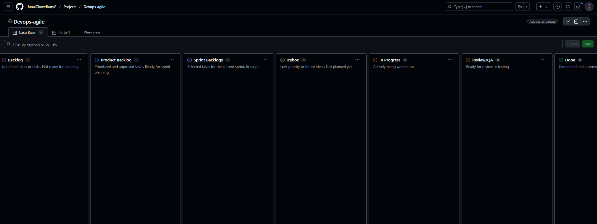


## **Parte 2: Crear una Plantilla de Issue para Historias de Usuario**

Se creo una plantilla de issue en GitHub para estandarizar las historias de usuario

**Detalles**:  
- Plantilla: **User Story** (en `.github/ISSUE_TEMPLATE/user-story.md`)
- Estructura: Secciones **User Story** (`As a`, `I need`, `So that`), **Context & Assumptions**, y **Acceptance Criteria** (formato Gherkin)
- con etiqueta automatica `user_story`


```markdown
---
name: User Story
about: Template for defining clear and structured user stories
title: ''
labels: user_story
assignees: ''

---

## User story  

**As a** _(specific role - e.g., "developer," "admin," "customer")_  
**I need** _(clear functionality or feature needed)_  
**So that** _(explain the value or business reason for this feature)_

---

##  **Context & Assumptions**  
- _List any known constraints, assumptions, or dependencies._
- _Mention related user stories or issues (if applicable)._

---

##  **Acceptance criteria**  
```gherkin
Scenario: <Short Description>
Given <initial context or system state>
When <user performs an action>
Then <expected outcome or behavior>
And <optional additional conditions>
```

**Evidencia**:  
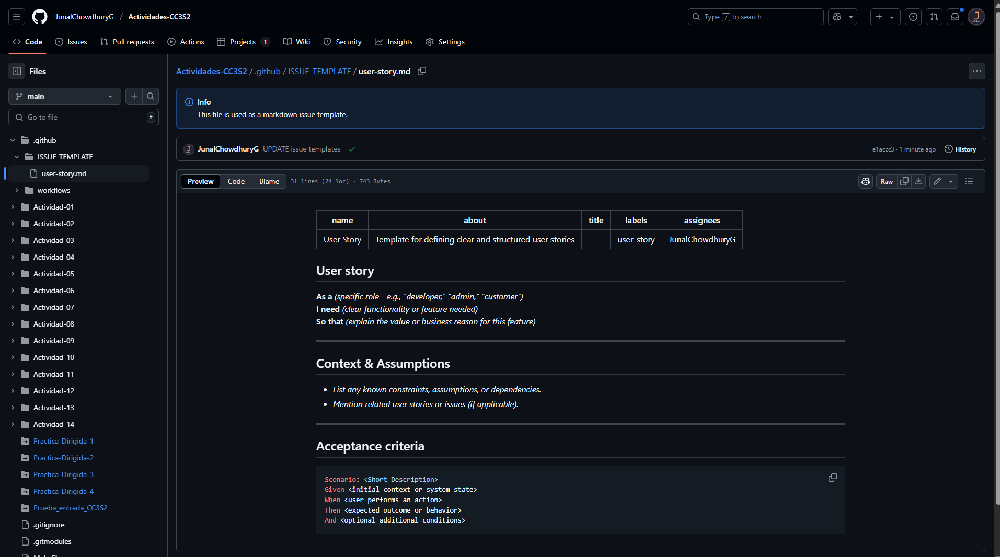


## **Parte 3: Crear y Priorizar Historias de Usuario**

Cree 7 historias de usuario usando la plantilla **User Story** y se priorizaron en el Kanban board

**Historias Creadas**:  
1. `[1] Need a service that has a counter`  
2. `[2] Must allow multiple counters`  
3. `[3] Must persist counter across restarts`  
4. `[4] Counters can be reset`  
5. `[5] Deploy service to the cloud`  
6. `[6] Need the ability to remove a counter`  
7. `[7] Need ability to update a counter to a new value`

**Priorizacion**:  
- **Product Backlog**: 
  - `Need a service that has a counter` (inicio)
  - `Must persist counter across restarts` (final)
  - `Counters can be reset` (final)
- **Icebox**: `Must allow multiple counters`
- **New Issues**: `Deploy service to the cloud`, `Need the ability to remove a counter`, `Need ability to update a counter to a new value` con limite de 7

**Evidencia**:  
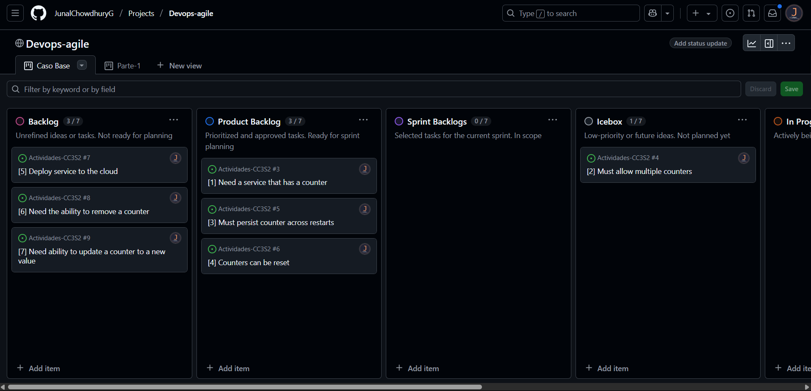


## **Parte 4: Refinamiento del Backlog**

Se refino el **Product Backlog** mediante triage de issues, adicion de detalles, y asignacion de etiquetas

**Detalles**:  
- **Triage**:
  - `Deploy service to the cloud` -> **Product Backlog**
  - `Need the ability to remove a counter` -> **Icebox** 
  - `Need ability to update a counter to a new value` -> **Product Backlog** 
- **Detalles Añadidos**: Todas las historias en **Product Backlog** tienen contexto, suposiciones, y criterios de aceptacion en formato Gherkin
- **Asignacion de Etiquetas**:
  - `Need a service that has a counter`: `enhancement`, `user story`.
  - `Must persist counter across restarts`: `enhancement`, `user story`.
  - `Deploy service to the cloud`: `technical debt`, `user story`.
  - `Counters can be reset`: `enhancement`, `user story`.
  - `Need ability to update a counter to a new value`: `enhancement`, `user story`.

**Evidencia**:
* Las etiquetas que se crearon y se kes asignaron a los Issues:  
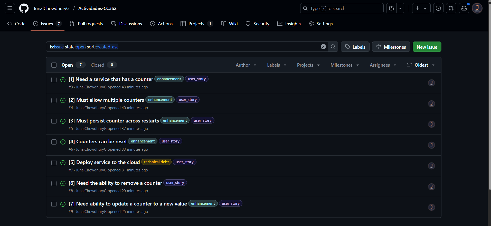


## **Ejercicio 1: Crear un Epic y Vincular Historias de Usuario**

Cree un Epic para organizar funcionalidades de contadores y se vincularon 3 historias de usuario 

**Detalles**:  
- **Epic**: `[Epic] Gestion de Contadores` con etiqueta `epic`
- **Historias Vinculadas**:
  - `[1] Need a service that has a counter` (#3)
  - `[2] Must allow multiple counters` (#4)
  - `[4] Counters can be reset` (#6)
- **Nueva Historia**:
  - `[8] Generate counter usage reports` (#10)

**Evidencia**:
* Se Creo la historia de usuaruio `[8] Generate counter usage reports`
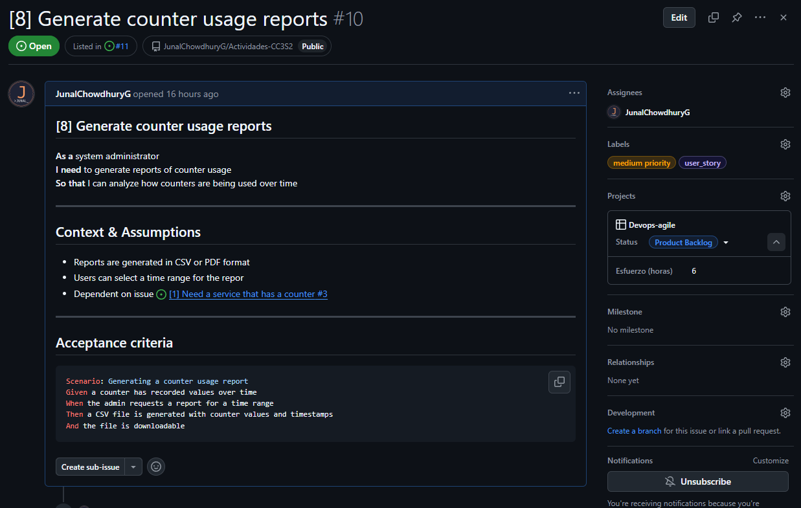

* Se creo el Issue con  etoqueta `epic`
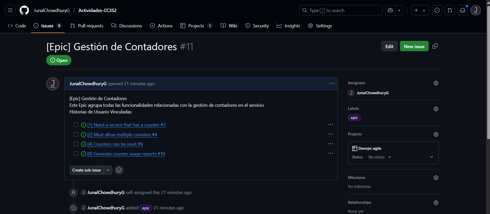


## **Ejercicio 2: Uso Avanzado de Etiquetas**

Cree etiquetas para priorizar y gestionar el estado de las 8 historias de usuario

**Detalles**:  
- **Nuevas Etiquetas**:
  - `high priority` 
  - `medium priority`
  - `low priority`
  - `in review`
  - `blocked` 
  - `ready for testing`
- **Asignaciones** (en **Product Backlog**):
  - `Need a service that has a counter`: `high priority`, `ready for testing`, `user story`
  - `Must persist counter across restarts`: `high priority`, `user story`
  - `Deploy service to the cloud`: `high priority`, `user story`
  - `Counters can be reset`: `medium priority`, `user story`
  - `Need ability to update a counter to a new value`: `medium priority`, `user story`
  - `Generate counter usage reports`: `medium priority`, `user story`
- **Icebox**: `Must allow multiple counters`, `Need the ability to remove a counter` solo `user story` y `low priority`
- **Epic**: `epic` 

**Evidencia**:
* Cree las etiquetas y las asigne a cada historia
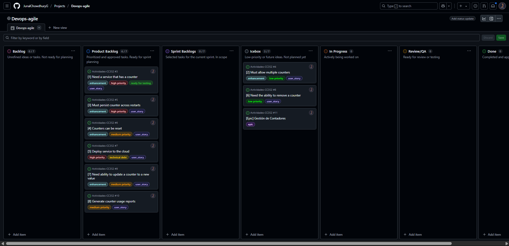


## **Ejercicio 4: Seguimiento de Tiempo y Esfuerzo**

Añadi campo para registrar el esfuerzo estimado de las 8 historias

**Detalles**:  
- **Campo**: `Esfuerzo (hours)` de tipo: numero
- **Estimaciones** en **Product Backlog**:
  - `[1] Need a service that has a counter`: 4 horas
  - `[3] Must persist counter across restarts`: 8 horas
  - `[5] Deploy service to the cloud`: 10 horas
  - `[4] Counters can be reset`: 3 horas
  - `[1] Need ability to update a counter to a new value`: 5 hora
  - `Generate counter usage reports`: 6 horas
- **Icebox**: Sin tiempo porque no son priorizadas
- **Epic**: Sin tiempo pr que son contenedor organizativo

**Evidencia**:  
Cada historia en **Product Backlog** tieenen un tiempo asignado
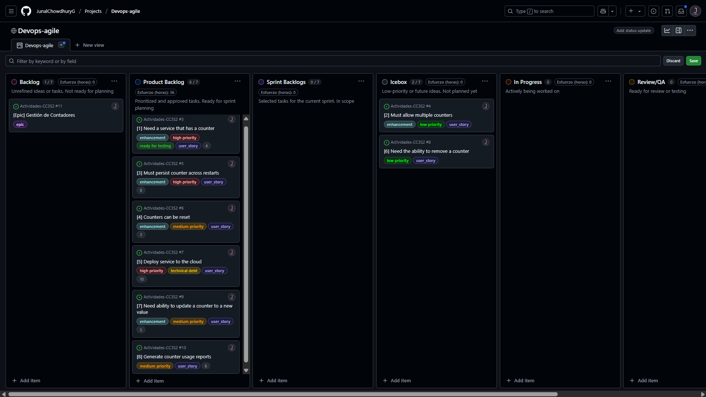


## **Ejercicio 5: Refinamiento de Backlog Basado en Comentarios**
Cree una nueva historia basada en comentarios de stakeholders

**Detalles**:  
- **Nueva Historia**: `[9] Export counter data to CSV` despues de `[8] Generate counter usage reports`
- **Vinculacion**: Añadida al Epic `[Epic] Gestion de Contadores`
- **Product Backlog Actualizado**: 7 historias 6 anteriores + 1 nueva


**Evidencia**:
* Las 9 historias de usuarios creadas, aasignadas con sus etiquetas y columnas
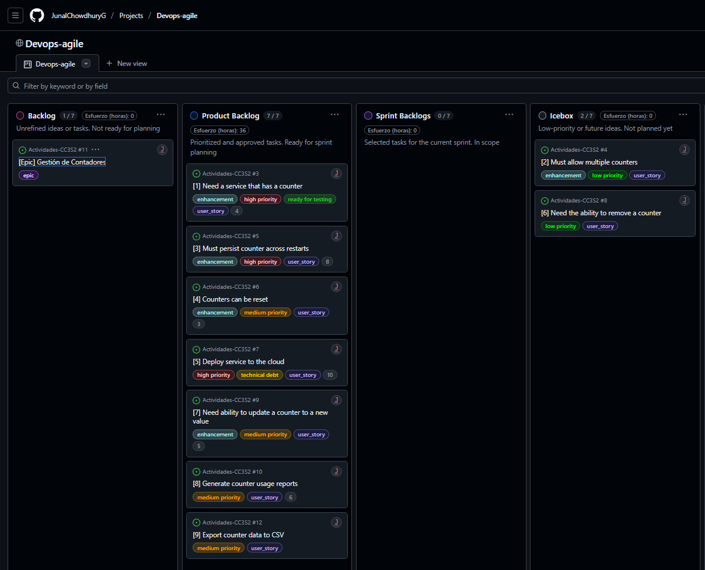
* tambien se actualizo el epic
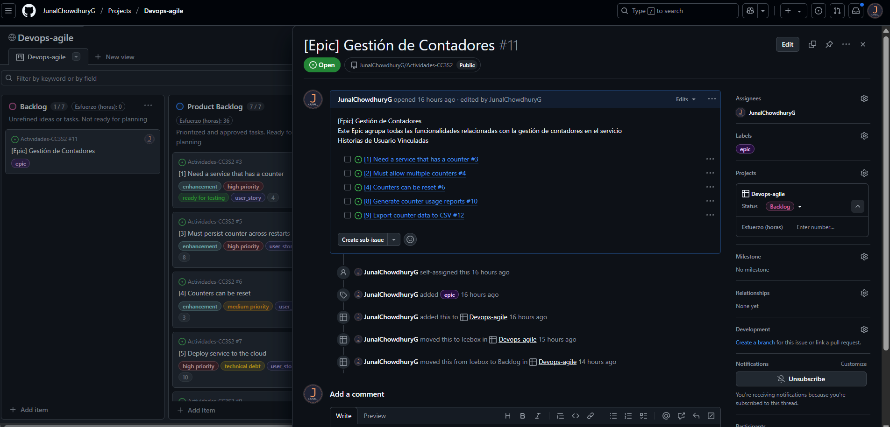

## **Ejercicio 6: Análisis del flujo de trabajo usando el Kanban board**
Analisando el tablero Kanban: 
[Tablero Kanban](https://github.com/users/JunalChowdhuryG/projects/2)

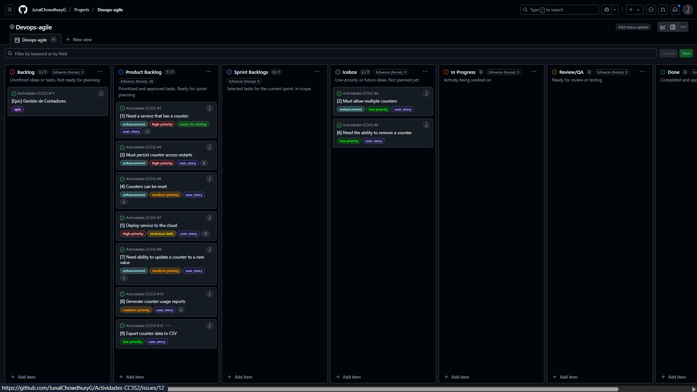

**Notamos que:**
* **Analisis**
  * En Product Backlog hay 7 historias, son excesivo para un sprint
  * La historia `[5] Deploy service to the cloud` tiene una duracion de 10 horas lo cual puede producir retraso p
  * El epic esta en Backlog y organiza historias sin afectar el flujo

* **cuellos de botella**
  * Backlog sobrecargado

* **Mejoras**
  * Asignar mas developers para reducir cargas
  * Dividir historias grandes como `[5] Deploy service to the cloud` que dura 10 horas
  * Mover historias no criticas por ejemplo el de `[9] Export counter data to CSV` a `Ìcebox`
