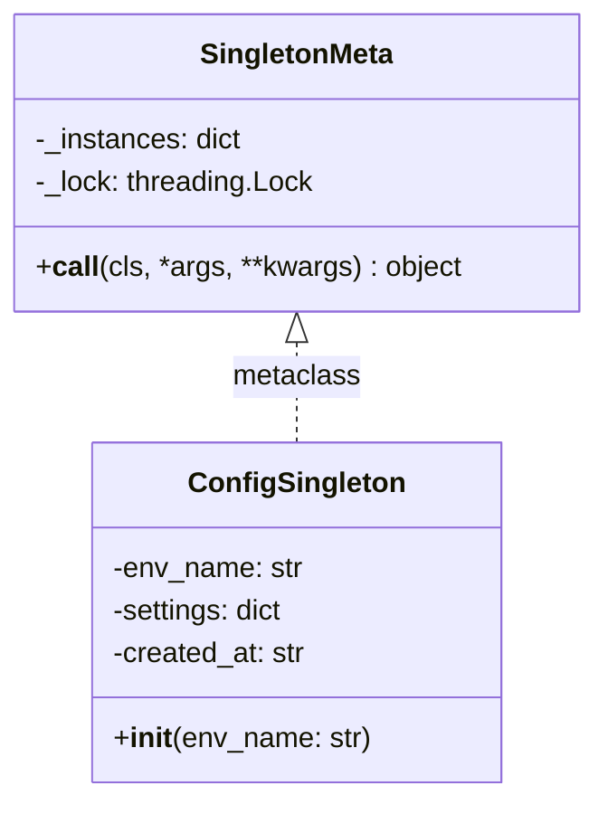
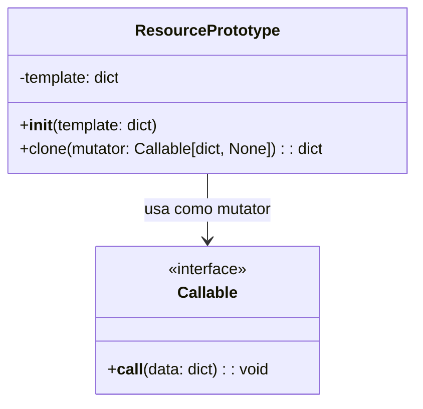
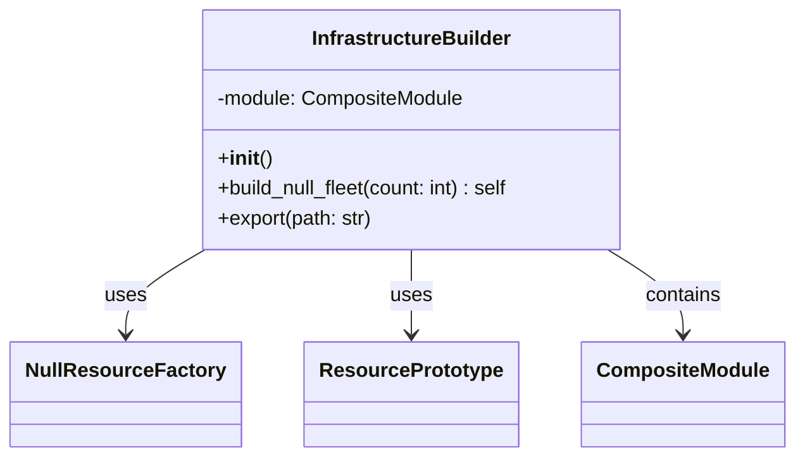

# **Actividad 21: Patrones para modulos de infraestructura**


## **Fase 1: Exploracion y analisis**


### **1. Singleton (singleton.py)**

```python
import threading
from datetime import datetime

class SingletonMeta(type):
    _instances: dict = {}
    _lock: threading.Lock = threading.Lock()

    def __call__(cls, *args, **kwargs):
        with cls._lock:
            if cls not in cls._instances:
                instance = super().__call__(*args, **kwargs)
                cls._instances[cls] = instance
        return cls._instances[cls]

class ConfigSingleton(metaclass=SingletonMeta):
    def __init__(self, env_name: str):
        self.env_name = env_name
        self.settings: dict = {}
        self.created_at: str = datetime.utcnow().isoformat()
```
#### **Explica como SingletonMeta garantiza una sola instancia y el rol del lock.**

* `SingletonMeta` es una metaclase controla la creacion de instancias de `ConfigSingleton`, `SingletonMeta` asegura que solo exista una instancia de `ConfigSingleton` la garantiaa de que solo una instancia es:
- el diccionario `_instances` guara toda las instancias que se han creaddo y utiliza la clase como indice ,   cuando se quiere intentar crear un instancia `__call__`  ese metodo verifica si la clase ya tiene una instancia en `_instances` en el caso que no exista se crea una nueva instancia usando `super().__call__(*args, **kwargs)` y lo almaceba en `_instances` pero en el caso que ya exista devuele la insatancia almacenada y asi evita crear una nueva instancia y tener duplicados

* el rol de `lock` en el caso de `threading.Lock` asegura que cuando se crea la instancia este sea seguro en entoornos multi hilos

* `with cls._lock` evita que  2 hilos creen instancias simultaneas esto evita romper el patron singleton sirve bastante en aplicaciones paralela o concurrentes 



### **2. Factory (factory.py)**

```python
class NullResourceFactory:
    @staticmethod
    def create(name: str, triggers: dict = None) -> dict:
        triggers = triggers or {
            "factory_uuid": str(uuid.uuid4()),
            "timestamp": datetime.utcnow().isoformat()
        }
        return {
            "resource": {
                "null_resource": {
                    name: {"triggers": triggers}
                }
            }
        }
```

#### **Detalla como la fabrica encapsula la creacion de `null_resource` y el proposito de sus `triggers`.**


* `NullResourceFactory` encapsula  creacion de recursos `null_resource` de terraform generando un diccionario estandar esto asegura consistencia y tambien reutilizacion al abstraer la logica de construccion

* el proposito de triggers en null_resource obligan a terraform a recrear o actualizar el recurso si cambian incluye `factory_uuid`  y timestamp (marca temporal) esto permite a terraform detectar cambios


### **3. Prototype (prototype.py)**

```python
# prototype.py
from copy import deepcopy
from typing import Callable

class ResourcePrototype:
    def __init__(self, template: dict):
        self.template = template

    def clone(self, mutator: Callable[[dict], None]) -> dict:
        new_copy = deepcopy(self.template)
        mutator(new_copy)
        return new_copy
```

#### **Dibuja un diagrama UML del proceso de clonacion profunda y explica como el mutator permite personalizar cada instancia.**


* **ResourcePrototype**: Clase que contiene un diccionario (template) como plantilla.

    - clone(mutator): hace un deepcopy del template
    - llama al mutator pasando la copia ya clonada
    - devuelve la copia modificada

* **Callable**:

    - representa una funcion que toma el diccionario y lo modifica en el lugar
    - esto encapsula la personalizacion en una funcion externa


### **4. Composite (composite.py)**

```python
# composite.py
from typing import List, Dict

class CompositeModule:
    def __init__(self):
        self.children: List[Dict] = []

    def add(self, block: Dict):
        self.children.append(block)

    def export(self) -> Dict:
        merged: Dict = {"resource": {}}
        for child in self.children:
            # Imagina que unimos dicts de forma recursiva
            for rtype, resources in child["resource"].items():
                merged["resource"].setdefault(rtype, {}).update(resources)
        return merged
```
#### **Describe como CompositeModule agrupa multiples bloques en un solo JSON valido para Terraform.**

* `CompositeModule` usa el patron Composite para:
    - agregar bloques de recursos (como null_resource) a una lista children con add
    - combinar todos los bloques en un diccionario unico con export, fusionando recursos del mismo tipo bajo la clave "resource"
    - garantiza un JSON valido para Terraform mediante la fusion recursiva

### **5. Builder (builder.py)**
```python
# builder.py
import json
from composite import CompositeModule
from factory import NullResourceFactory
from prototype import ResourcePrototype

class InfrastructureBuilder:
    def __init__(self):
        self.module = CompositeModule()

    def build_null_fleet(self, count: int):
        base = NullResourceFactory.create("app")
        proto = ResourcePrototype(base)
        for i in range(count):
            def mutator(block):
                # Renombrar recurso "app" a "app_<i>"
                res = block["resource"]["null_resource"].pop("app")
                block["resource"]["null_resource"][f"app_{i}"] = res
            self.module.add(proto.clone(mutator))
        return self

    def export(self, path: str = "terraform/main.tf.json"):
        with open(path, "w") as f:
            json.dump(self.module.export(), f, indent=2)
```

#### **Explicar cómo InfrastructureBuilder orquesta Factory -> Prototype -> Composite y genera el JSON final**

- **factory**  crea un recurso base con NullResourceFactory.create
- **prototype**: usa ResourcPrototype para clonar y personalizar recursos
- **composite:** agrega los clones a CompositeModule, que los fusiona
- **export**: escribe el JSON final en terraform/main.tf.json


