# Evidencia Tecnica - Dia 1

## Verificacion del Contenedor PostgreSQL
**En la rama `feature/dia1`**
### 1. Configuracion e Inicializacion
**Construccion y despliegue del contenedor:**
```bash
# Desde el directorio que contiene docker-compose.yml
docker-compose up -d --build
```
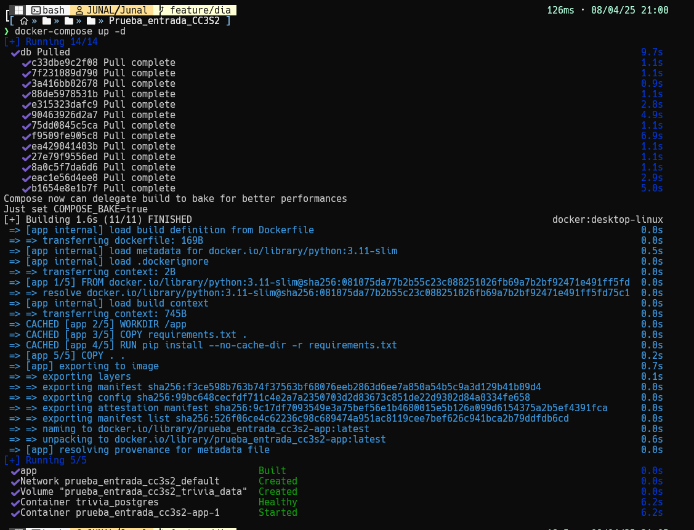


**Verificacion del estado del contenedor:**
```bash
docker ps -f name=trivia_postgres
```

### 2. Conexion a la Base de Datos
**Acceso interactivo a PostgreSQL:**
```bash
docker exec -it trivia_postgres psql -U postgres -d trivia_db
```
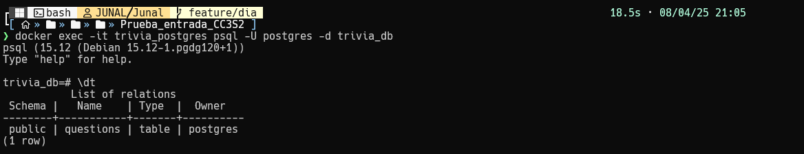
### 3. Verificacion de Estructura de Datos
**Listado de tablas disponibles:**
```sql
\dt
```
*Salida esperada:*
```
        List of relations
 Schema |   Name    | Type  |  Owner   
--------+-----------+-------+----------
 public | questions | table | postgres

```

**Consulta de datos de ejemplo:**
```sql
SELECT * FROM questions;
```
*Salida esperada:*
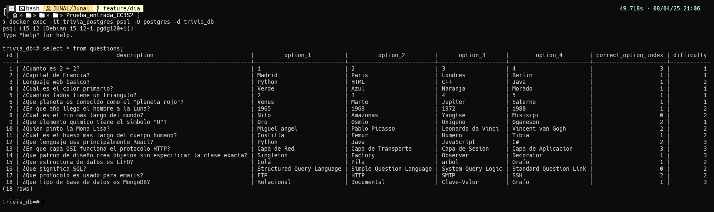


# Evidencia Tecnica - Dia 2
**En la rama `feature/dia2`**
### 1. Configuracion e Inicializacion
**Construccion y despliegue del contenedor:**
```bash
# Desde el directorio que contiene docker-compose.yml
docker-compose up -d --build
```
*Salida esperada:*
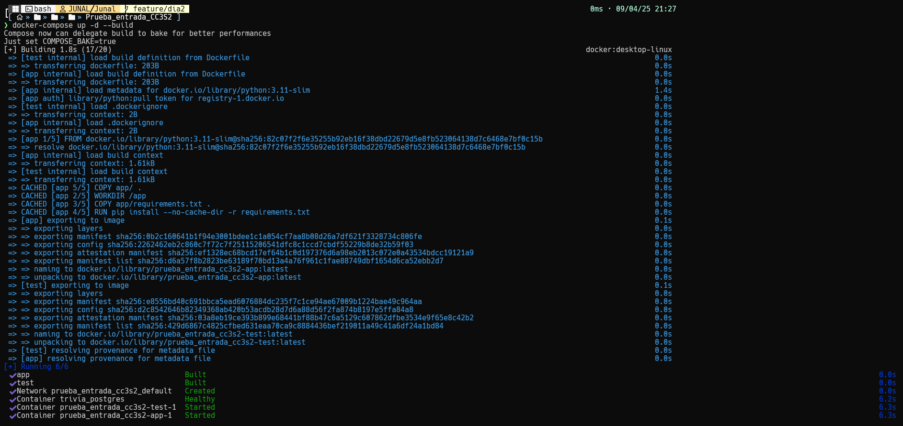

### 2. Ejecucion de las pruebas 
Ejecucion de pruebas unitarias para la clase `Question` y prueba integracion para para validar que `get_questions_from_db()` retorna una lista de preguntas validas desde la base de datos.
```bash
# Desde el directorio que contiene docker-compose.yml
docker-compose run --rm test
```
*Salida esperada:*
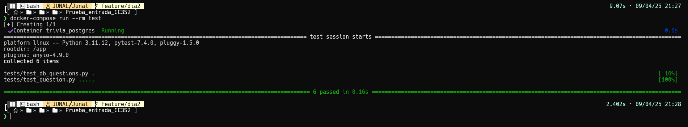

# Evidencia Tecnica - Dia 3
**En la rama `feature/dia3-4-estructura-basic`**
## **Construccion y despliegue del contenedor:**
```bash
# Desde el directorio que contiene docker-compose.yml
docker-compose up -d --build
```
*Salida esperada:*
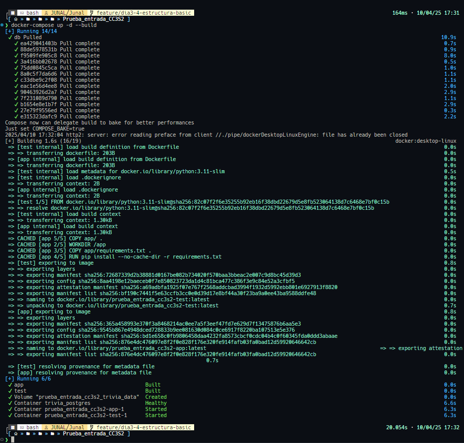

## **Ejecutamos la `app`**
- Se observa 10 preguntas que pertenenecen a un objeto de la clase `Quiz` (solo preguntas) los cuales se obtiene de manera aleatoria de un banco de preguntas en la base de datos a travez del metodo `get_questions_from_db()` de `database.py`
```bash
docker-compose run app 
```
*Salida esperada:*
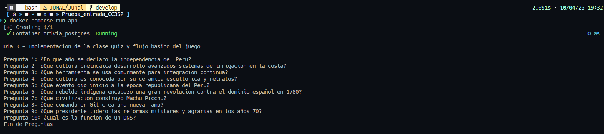

## **Tests de la clase `Quiz`**
- Se implemento 4  pruebas unitarias para la clase `Quiz`, con lo cual da un total de 10 pruebas en lo que va el proyeecto

```bash
# Desde el directorio que contiene docker-compose.yml
docker-compose run --rm test
```
*Salida esperada:*
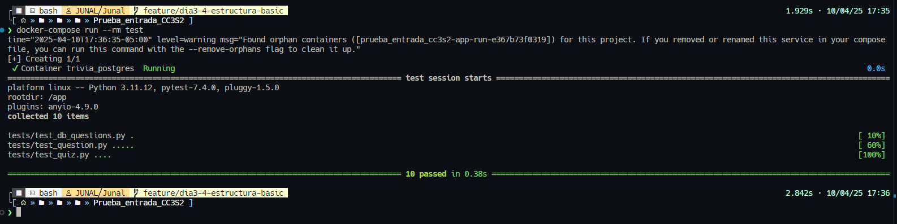

# Evidencia Tecnica - Dia 4
**En la rama `feature/dia3-4-estructura-basic`**
## **Construccion y despliegue del contenedor:**
```bash
# Desde el directorio que contiene docker-compose.yml
docker-compose up -d --build
```
*Salida esperada:*
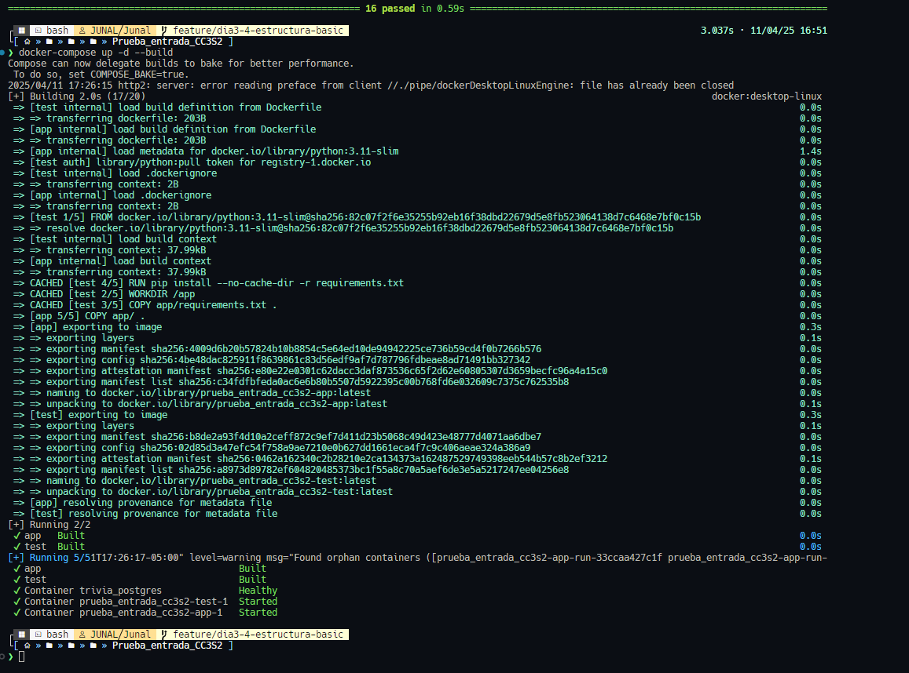

## **Ejecutamos la `app`**
- Poe el momento la app verifica la respuestas del `Quiz` y contabiliza la respuestas correctas e incorrectas
```bash
docker-compose run app 
```
*Salida esperada:*
- Inicio de la secuencia de preguntas
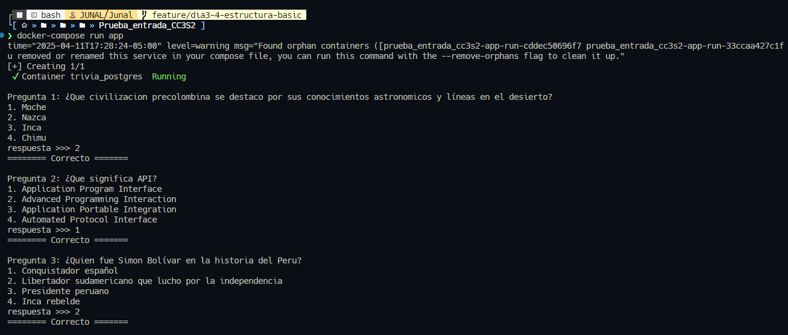

- Final de la secuencia de preguntas
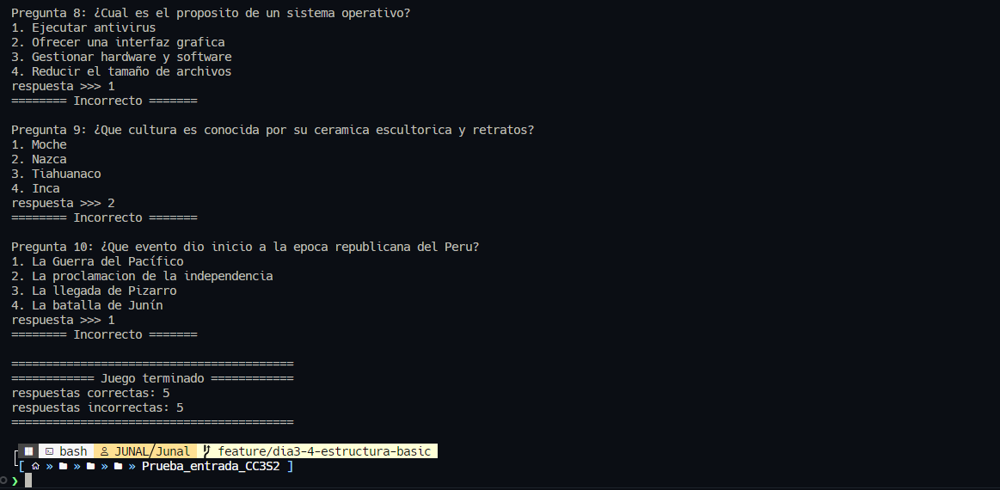

## **Tests**
- Se implemento 6  tests adicionales, con lo cual da un total de 16 pruebas en lo que va el proyeecto

```bash
# Desde el directorio que contiene docker-compose.yml
docker-compose run --rm test
```
*Salida esperada:*
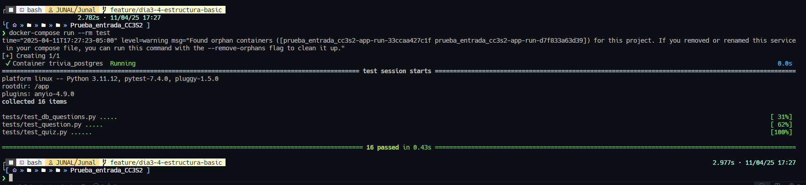

# Evidencia Tecnica - Dia 5
**En la rama `feature/dia5-ui-improvements`**
## 1. Configuracion e Inicializacion
**Construccion y despliegue del contenedor:**
```bash
# Desde el directorio que contiene docker-compose.yml
docker-compose up -d --build
```
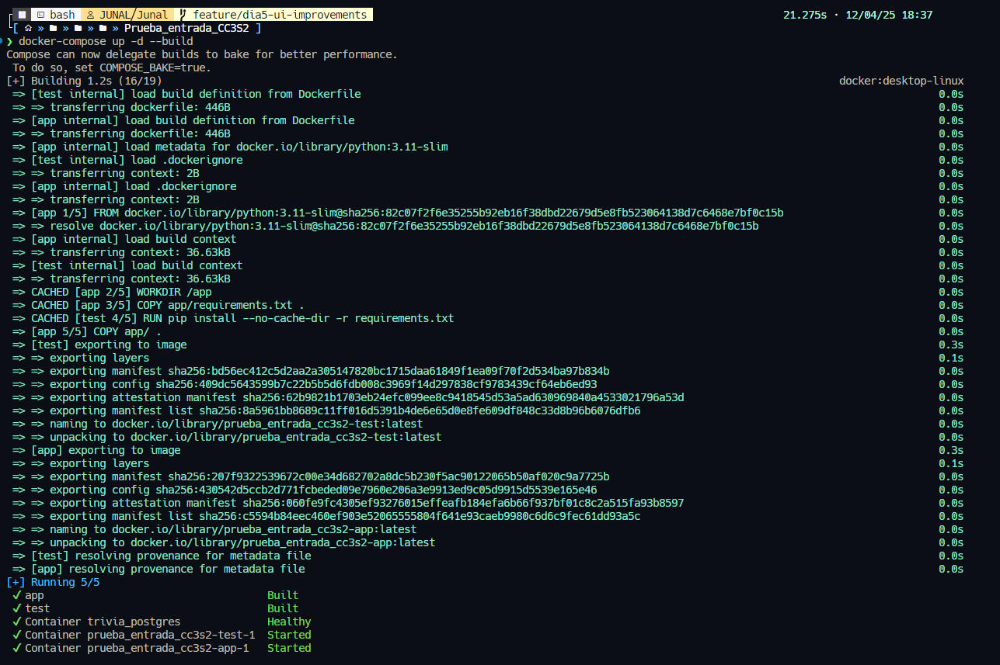
## 2. Eleccion de Interfaz
En el `Dockerfile` podemos configurar si utilizamos la interfaz por terminal o por web.

```dockerfile
# para ejecutar la interfaz en navegador (localhost:5000)
CMD ["python", "app.py"]

# para ejecutar la interfaz enterminal
#CMD ["python", "main.py"]
```
Uno de ellos debe estar comentado para la ejecucion del otro

### Ejecucion por navegador
1. Asegurese de que el dockerfile este configurado asi (configuracion predeterminada)

```dockerfile
# para ejecutar la interfaz en navegador (localhost:5000)
CMD ["python", "app.py"]

# para ejecutar la interfaz enterminal
#CMD ["python", "main.py"]
```

2. Al construir y desplegar el contenedor con el comando:
```bash
# Desde el directorio que contiene docker-compose.yml
docker-compose up -d --build
```

3. Automaticamente ya esta disponible el `http://localhost:5000/`
```
http://localhost:5000/
```

4. En el navegador, podra observar la pagina principal (inicio) del `Quiz` donde eligira la dificultad
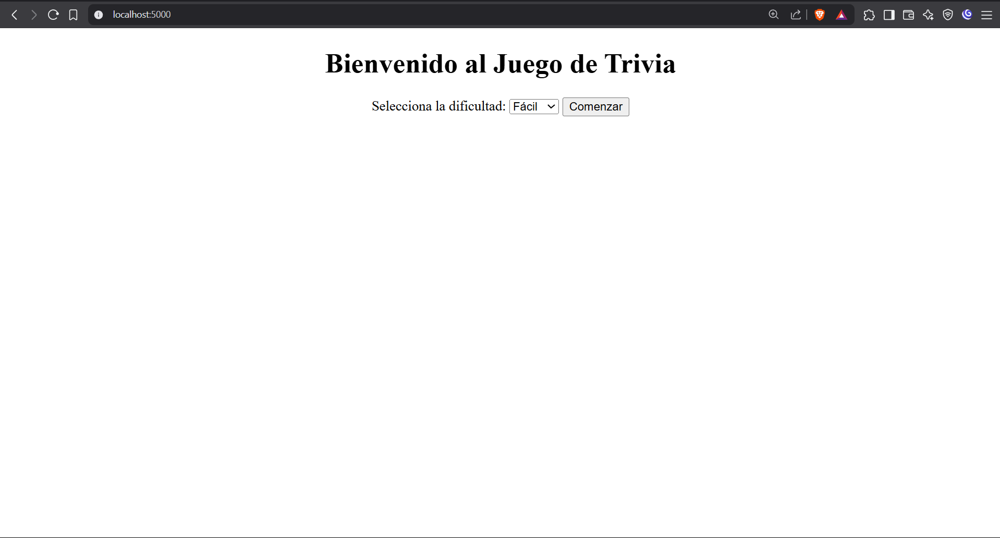

5. Una vez que elija la dificultad, inicia el `Quiz` con las preguntas del nivelde dificultad elegida
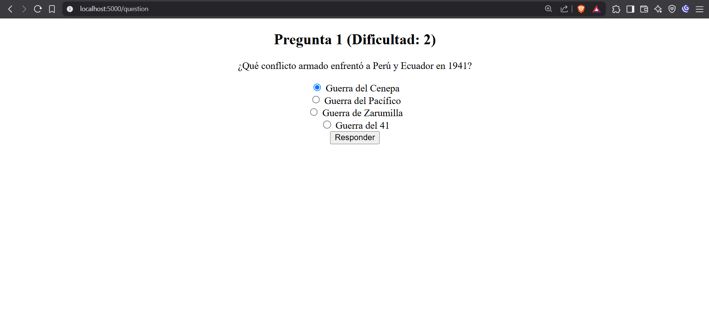

6. Los `Quiz` constan de 10 preguntas, una vez completada las 10 preguntas, se mostraran los resultados
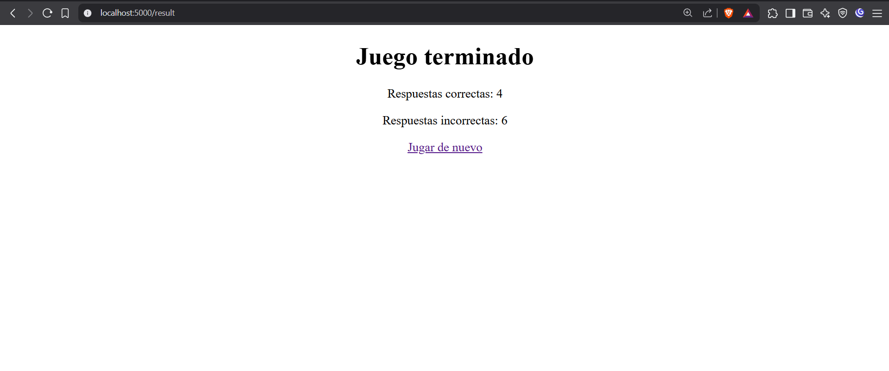

### Ejecucion por terminal
1. Asegurese de que el dockerfile este configurado asi !Esto es importante:

```dockerfile
# para ejecutar la interfaz en navegador (localhost:5000)
# CMD ["python", "app.py"]

# para ejecutar la interfaz enterminal
CMD ["python", "main.py"]
```

2. Al construir y desplegar el contenedor con el comando:
```bash
# Desde el directorio que contiene docker-compose.yml
docker-compose up -d --build
```

3. Tendra que ejecutar el siguiente comando en la terminal
```shell
docker-compose run app
```
4. Al ejecutar el comando aparecera un menu para elegir la dificultad del `Quiz`, el nivel mixto son preguntas de distintos niveles
```
Dia 5 - Mejoras en la interfaz de usuario y refinamientos

=========================================
Bienvenido al Quiz de Historia del Peru
=========================================
Elige la dificultad del Quiz
1. Facil
2. Intermedio
3. Dificil
4. Mixto
respuesta >>> 
```
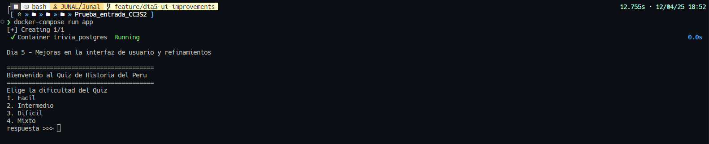


5. Una vez que elija la dificultad, inicia el `Quiz` con las preguntas del nivelde dificultad elegida
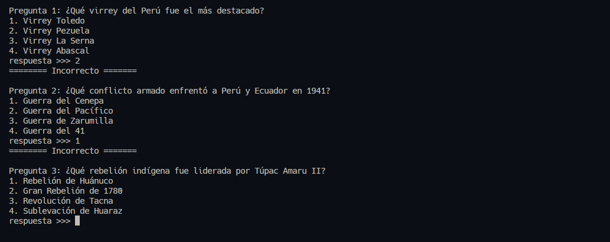

6. Los `Quiz` constan de 10 preguntas, una vez completada las 10 preguntas, se mostraran los resultados
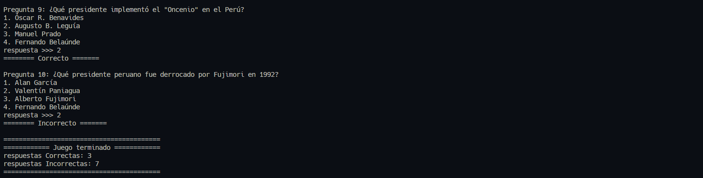

## **Tests**
- Ejecuta los tests:

```bash
# Desde el directorio que contiene docker-compose.yml
docker-compose run --rm test
```
*Salida esperada:*
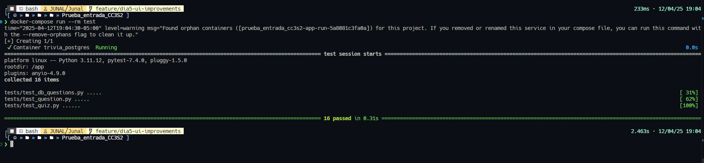


# Evidencia Tecnica - Dia 6
1. Asegurese de que el dockerfile este configurado asi !Esto es importante:

```dockerfile
# para ejecutar la interfaz en navegador (localhost:5000)
CMD ["python", "app.py"]

# para ejecutar la interfaz enterminal
#CMD ["python", "main.py"]
```

2. Al construir y desplegar el contenedor con el comando:
```bash
# Desde el directorio que contiene docker-compose.yml
docker-compose up -d --build
```

3. Ejecutamos las pruebas
```bash
# Desde el directorio que contiene docker-compose.yml
docker-compose run --rm test
```
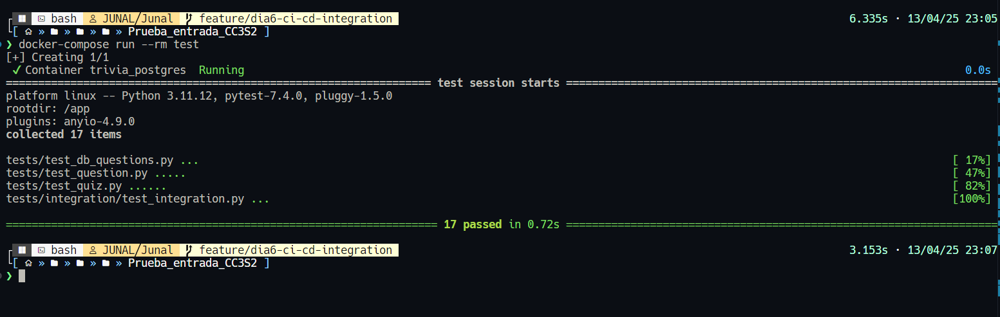
- Observamos que se ejecuta correctamente los 17 test entre ellos los test de integracion

4. Subimos todo a github
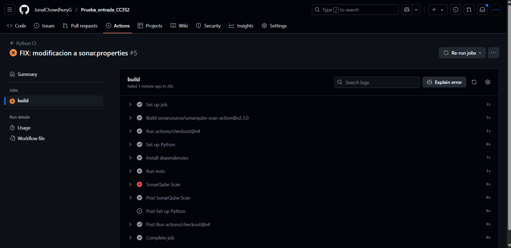
- Vemos que el `github/workflows` falla, esto debido a una falta de configuracion en el SonarQube

5. Tests en github Actions
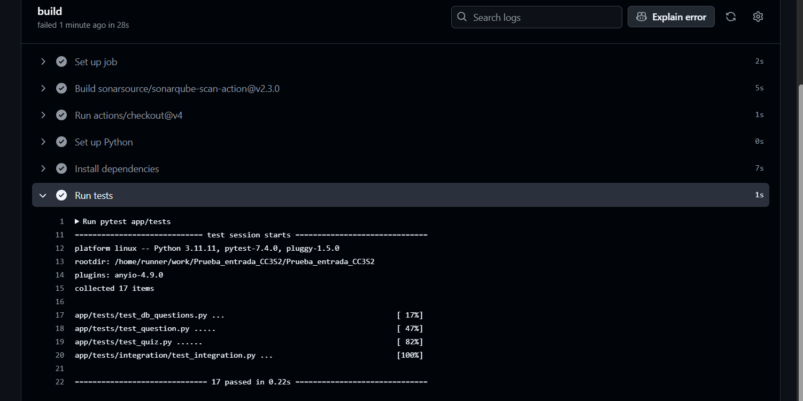
- A pesar de que el  `github/workflows` falle, vemos que si llega a completarse todos los tests

# Evidencia Tecnica - Dia 7

1. Asegurese de que el dockerfile este configurado asi !Esto es importante:
```dockerfile
# para ejecutar la interfaz en navegador (localhost:5000)
CMD ["python", "app.py"]

# para ejecutar la interfaz enterminal
#CMD ["python", "main.py"]
```
La funcionalidad es la misma que el dia 6

2. Al construir y desplegar el contenedor con el comando:
```bash
# Desde el directorio que contiene docker-compose.yml
docker-compose up -d --build
```
3. Ejecutamos las pruebas
```bash
# Desde el directorio que contiene docker-compose.yml
docker-compose run --rm test
```
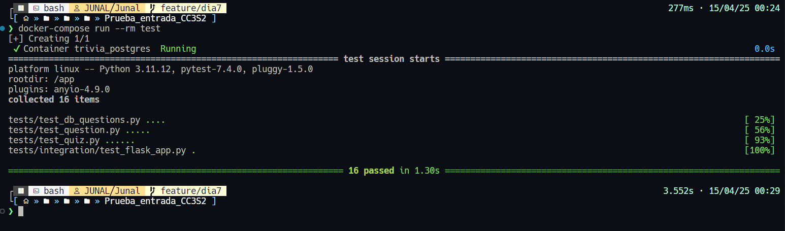

4. Verificamos la interfaz grafica en `http://localhost:5000/`
La funcionalidad es la misma que el dia 6

5. Verificamos que el CI funcione en `github-actions` en [github.com/JunalChowdhuryG/Prueba_entrada_CC3S2](https://github.com/JunalChowdhuryG/Prueba_entrada_CC3S2/tree/feature/dia7), aunque el SonarCloud aun siga dando error, mas adelante lo solucionaremos
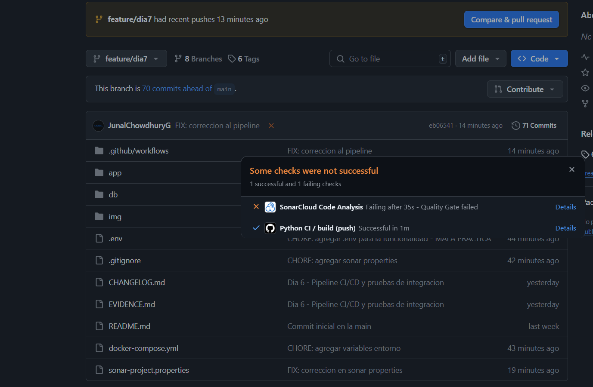

6. Comprobamos que si paso los jobs
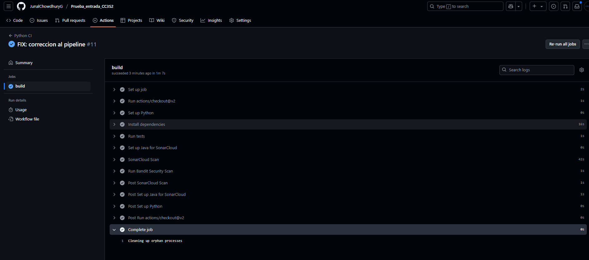

7. Verificamos que si paso el SCAN  de BANDIT
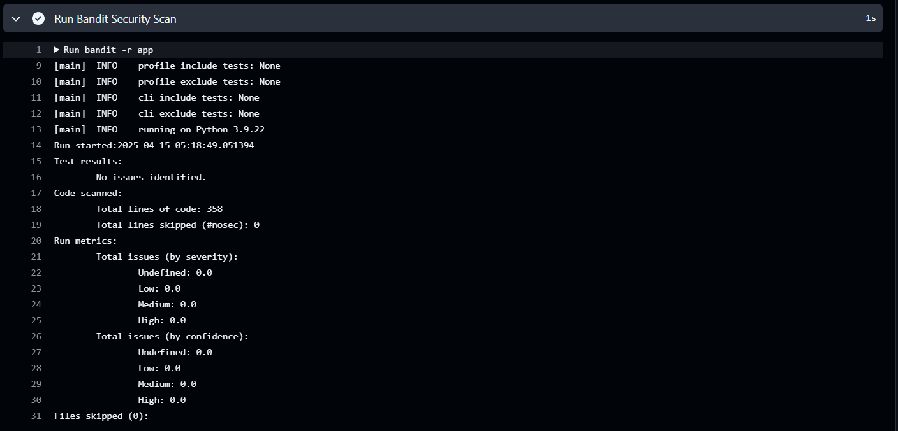