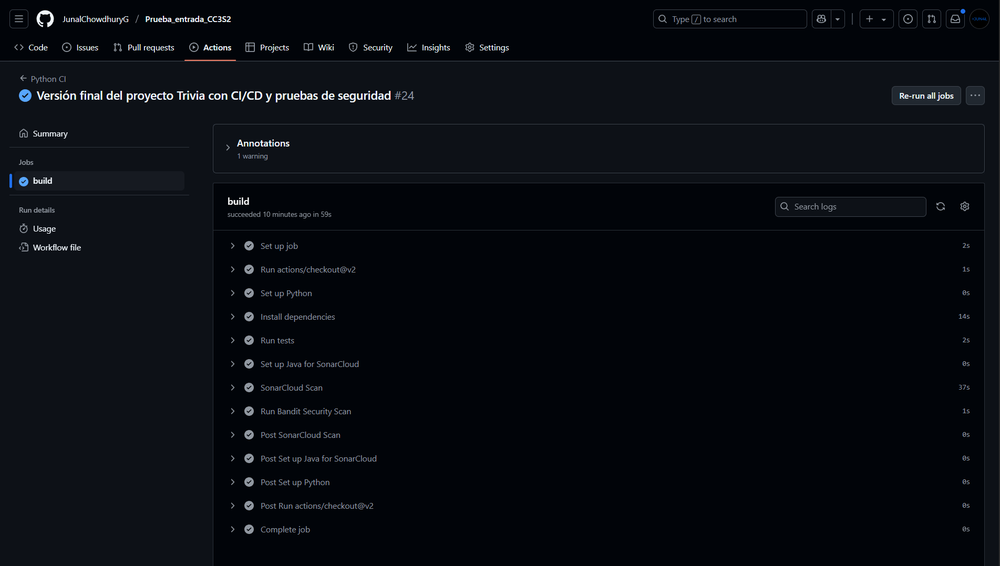
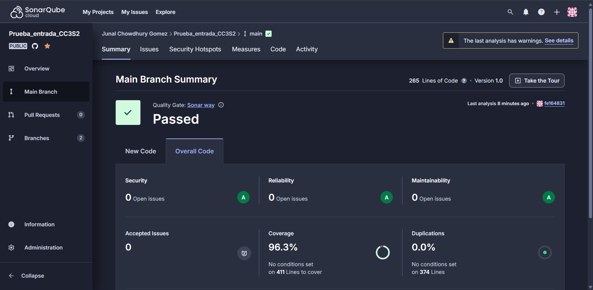
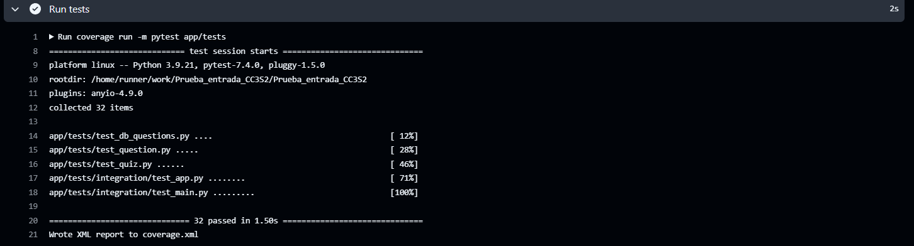
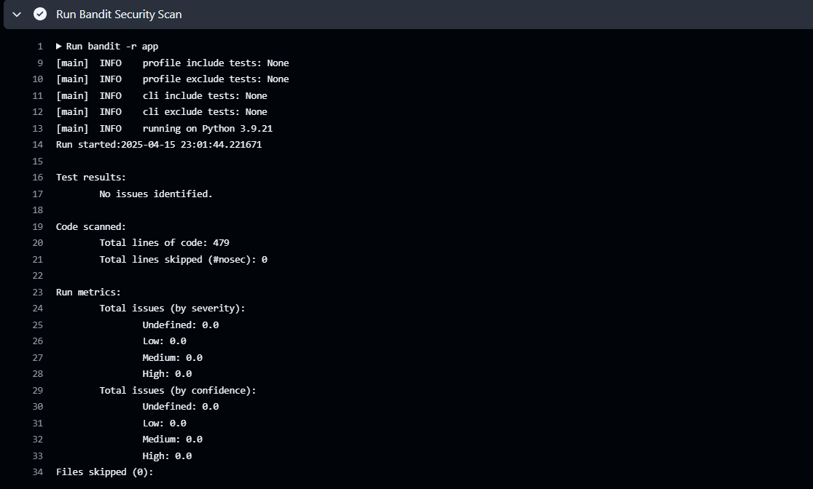

# Reporte de Validación de Calidad  
*(Fecha: 15/04/2025)*  

## 1. **GitHub Actions (CI/CD)**  
- **Estado:** Todas las workflows pasan correctamente.  
- **Evidencia:**  
  
- **Verificar:**
    [Lo puede verificar aqui](https://github.com/JunalChowdhuryG/Prueba_entrada_CC3S2/actions)

## 2. **SonarQube**  
- **Cobertura de código:** **96.3%** (mínimo requerido: 90%).  
- **Calidad del código:** A (Sin bugs críticos/de seguridad).  
- **Evidencia:**  
  
- **Verificar:**
    [Lo puede verificar aqui](https://sonarcloud.io/summary/new_code?id=JunalChowdhuryG_Prueba_entrada_CC3S2&branch=main)
 
## 3. **Pruebas Unitarias/Integración**  
- **Cobertura de pruebas:** **96.3%** (unittest).  
- **Resultado:** Todas las pruebas pasan.  
- **Evidencia:**  
  

## 4. **Bandit - Sin Vulnerabilidades**  
  
